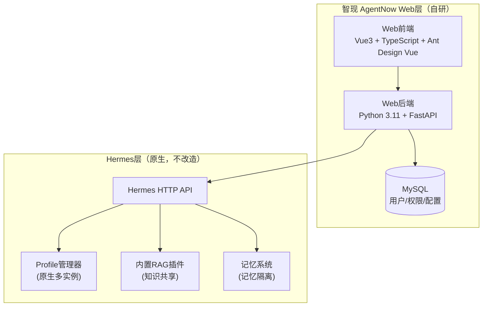

# 智现 AgentNow 企业智能体平台

基于 Hermes 开源智能体框架的企业级 Web 封装平台，为企业提供统一的智能体管理和使用入口。

---

## 📋 目录

- [项目概述](#项目概述)
- [技术架构](#技术架构)
- [项目结构](#项目结构)
- [快速开始](#快速开始)
- [核心功能](#核心功能)
- [相关文档](#相关文档)

---

## 🎯 项目概述

### 1.1 项目定位

**智现 AgentNow** 是一个基于 [Hermes](https://github.com/cixing-official/hermes) 开源智能体框架的企业级 Web 封装平台。

**核心原则**：

| 原则 | 说明 |
|------|------|
| **不对 Hermes 进行任何改造** | 完全通过 API 方式对接，两个项目完全解耦 |
| **利用 Hermes 原生能力** | 多实例隔离、内置 RAG、记忆系统等全部使用 Hermes 现有功能 |
| **Web 层只做外围封装** | 权限管理、用户界面、企业级适配 |

### 1.2 设计理念

```
┌─────────────────────────────────────────────────────────────┐
│                      智现 AgentNow Web 层                     │
│  ┌─────────────┐  ┌─────────────┐  ┌─────────────────────┐ │
│  │  Web 前端    │  │  权限管理    │  │  Hermes API 代理    │ │
│  │  (界面展示)  │  │  (用户/角色) │  │  (请求转发/用户映射) │ │
│  └─────────────┘  └─────────────┘  └─────────────────────┘ │
└───────────────────────────┬─────────────────────────────────┘
                            │ HTTP API
                            ▼
┌─────────────────────────────────────────────────────────────┐
│                    Hermes 智能体服务层（原生）                │
│  ┌─────────────────────────────────────────────────────┐    │
│  │              Hermes 多实例隔离（原生能力）             │    │
│  │  ┌──────────┐ ┌──────────┐ ┌──────────┐            │    │
│  │  │ Profile A│ │ Profile B│ │ Profile N│            │    │
│  │  │ (员工A)  │ │ (员工B)  │ │ (员工N)  │            │    │
│  │  └──────────┘ └──────────┘ └──────────┘            │    │
│  └─────────────────────────────────────────────────────┘    │
│  ┌─────────────┐  ┌─────────────┐  ┌─────────────────────┐ │
│  │ 内置 RAG    │  │ 记忆系统    │  │ 工具调用/自进化      │ │
│  │ (知识共享)  │  │ (记忆隔离)  │  │                     │ │
│  └─────────────┘  └─────────────┘  └─────────────────────┘ │
└─────────────────────────────────────────────────────────────┘
```

---

## 🏗️ 技术架构

### 2.1 整体架构



### 2.2 技术选型

| 层级 | 技术选型 | 说明 |
|------|----------|------|
| **前端** | Vue 3 + TypeScript + Ant Design Vue | 企业级组件库，快速开发 |
| **后端** | Python 3.11 + FastAPI | 与 Hermes 技术栈一致，API 对接方便 |
| **数据库** | MySQL 8.0+ | 简单、成熟、团队熟悉 |
| **智能体** | Hermes（最新版本） | 不改造，仅通过 API 对接 |
| **RAG** | Hermes 内置 RAG 插件 | 不单独部署，复用 Hermes 能力 |

### 2.3 关键设计原则

1. **Hermes 不改造**：所有智能体能力全部使用 Hermes 现有功能，仅通过 HTTP API 对接
2. **完全解耦**：Web 层和 Hermes 层是两个独立项目，通过 API 通信
3. **Profile 映射**：每个企业员工映射到 Hermes 的一个独立 Profile，实现记忆隔离
4. **共享知识库**：使用 Hermes 内置 RAG，所有 Profile 共享同一知识库

---

## 📁 项目结构

```
AgentNow/
├── frontend/                    # 前端应用
│   ├── src/
│   │   ├── api/                # API 接口层
│   │   ├── router/             # 路由配置
│   │   ├── stores/             # 状态管理 (Pinia)
│   │   ├── types/              # TypeScript 类型定义
│   │   ├── views/              # 页面组件
│   │   ├── App.vue             # 根组件
│   │   └── main.ts             # 入口文件
│   ├── vite.config.ts          # Vite 配置
│   └── README.md               # 前端文档
│
├── backend/                     # 后端服务
│   ├── app/
│   │   ├── main.py             # FastAPI 入口
│   │   ├── config.py           # 配置管理
│   │   ├── models/             # 数据模型 (SQLAlchemy)
│   │   ├── routers/            # API 路由
│   │   ├── schemas/            # Pydantic 数据模型
│   │   └── services/           # 业务逻辑层
│   ├── data/
│   │   └── database.sql        # 数据库初始化脚本
│   ├── pyproject.toml          # Python 项目配置
│   └── README.md               # 后端文档
│
├── md/                          # 项目文档
│   ├── SPEC.md                 # MVP 规格说明书
│   └── init.md                 # 项目初始化记录
│
└── README.md                    # 本文档
```

---

## 🚀 快速开始

### 3.1 环境准备

确保已安装以下软件：

| 软件 | 版本要求 | 说明 |
|------|----------|------|
| Python | 3.11+ | 后端运行环境 |
| Node.js | 18+ | 前端运行环境 |
| MySQL | 8.0+ | 数据库 |
| UV | 最新版 | Python 包管理器 |

### 3.2 启动步骤

#### 步骤 1：克隆项目

```bash
cd AgentNow
```

#### 步骤 2：配置数据库

创建 MySQL 数据库：

```sql
CREATE DATABASE IF NOT EXISTS agentnow DEFAULT CHARACTER SET utf8mb4 COLLATE utf8mb4_unicode_ci;
```

#### 步骤 3：启动后端服务

```bash
cd backend

# 安装依赖
uv sync

# 配置环境变量
cp .env.example .env
# 编辑 .env，修改数据库连接配置

# 启动开发服务器
uv run uvicorn app.main:app --reload --host 0.0.0.0 --port 5117
```

后端服务启动后访问：
- API 文档：http://localhost:5117/docs
- 健康检查：http://localhost:5117/health

#### 步骤 4：启动前端服务

```bash
cd frontend

# 安装依赖
npm install

# 启动开发服务器
npm run dev
```

前端服务启动后访问：
- 应用地址：http://localhost:5116

### 3.3 端口说明

| 服务 | 端口 | 说明 |
|------|------|------|
| 后端 API | 5117 | FastAPI 服务 |
| 前端应用 | 5116 | Vue 开发服务器 |

### 3.4 默认账号

首次启动后端服务时会自动创建默认管理员账号：

- **账号**: `13651165117`
- **默认密码**: `123456`
- **角色**: `admin`

> ⚠️ **重要提示**：首次登录后必须修改密码！

---

## ✨ 核心功能

### 4.1 已实现功能

#### 用户认证系统

| 功能 | 状态 | 说明 |
|------|------|------|
| 用户登录 | ✅ 已实现 | 手机号 + 密码登录，JWT Token 认证 |
| 用户登出 | ✅ 已实现 | 清除本地 Token 和状态 |
| 修改密码 | ✅ 已实现 | 支持首次登录强制修改默认密码 |
| 权限校验 | ✅ 已实现 | 路由守卫 + API 接口权限 |
| 角色管理 | ✅ 已实现 | 支持 admin / user 两种角色 |

#### 技术框架

| 模块 | 状态 | 说明 |
|------|------|------|
| 前端框架 | ✅ 已搭建 | Vue 3 + TypeScript + Vite |
| UI 组件库 | ✅ 已集成 | Ant Design Vue + 主题定制 |
| 状态管理 | ✅ 已集成 | Pinia + localStorage 持久化 |
| 路由管理 | ✅ 已配置 | Vue Router + 路由守卫 |
| 后端框架 | ✅ 已搭建 | FastAPI + SQLAlchemy 2.0 |
| 数据库连接 | ✅ 已配置 | MySQL + PyMySQL |
| API 文档 | ✅ 自动生成 | Swagger UI / ReDoc |

### 4.2 规划中功能

- [ ] 智能体对话功能
- [ ] 对话历史管理
- [ ] Hermes Profile 自动映射
- [ ] 知识库管理
- [ ] 用户列表管理
- [ ] 多角色权限细化

---

## 📚 相关文档

### 详细文档

| 文档 | 路径 | 说明 |
|------|------|------|
| 后端服务文档 | [backend/README.md](./backend/README.md) | 后端 API、配置、部署说明 |
| 前端应用文档 | [frontend/README.md](./frontend/README.md) | 前端架构、组件、开发指南 |
| MVP 规格说明书 | [md/SPEC.md](./md/SPEC.md) | 完整的项目需求和技术规格 |

### 外部链接

- [Hermes GitHub](https://github.com/cixing-official/hermes) - 开源智能体框架
- [FastAPI 文档](https://fastapi.tiangolo.com/) - 后端框架
- [Vue 3 文档](https://vuejs.org/) - 前端框架
- [Ant Design Vue 文档](https://antdv.com/) - UI 组件库

---

## 📝 版本信息

| 项目 | 版本 |
|------|------|
| 智现 AgentNow | v0.1.0 (MVP) |
| 后端服务 | v0.1.0 |
| 前端应用 | v0.1.0 |
| 规格文档 | v1.1 |

---

## 📄 许可证

内部使用

---

> 本文档为 MVP 版本说明，目标是快速验证核心架构可行性。后续版本将逐步扩展功能。
