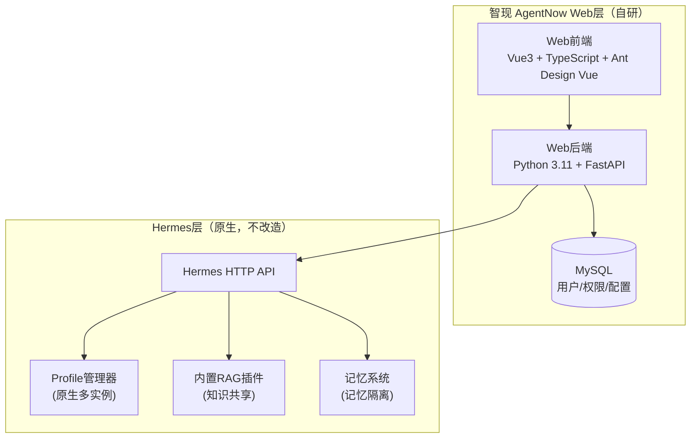

# 智现 AgentNow 企业智能体平台 - MVP规格说明书

> 版本：v1.1 (精简版)  
> 日期：2026-04-27  
> 状态：MVP版本

---

## 一、项目概述

### 1.1 项目定位

**智现 AgentNow** 是一个基于 Hermes 开源智能体框架的企业级 Web 封装平台。

**核心原则**：
- **不对 Hermes 进行任何改造**：完全通过 API 方式对接，两个项目完全解耦
- **利用 Hermes 原生能力**：多实例隔离、内置 RAG、记忆系统等全部使用 Hermes 现有功能
- **Web 层只做外围封装**：权限管理、用户界面、企业级适配

### 1.2 核心架构

```
┌─────────────────────────────────────────────────────────────┐
│                      智现 AgentNow Web 层                     │
│  ┌─────────────┐  ┌─────────────┐  ┌─────────────────────┐ │
│  │  Web 前端    │  │  权限管理    │  │  Hermes API 代理    │ │
│  │  (界面展示)  │  │  (用户/角色) │  │  (请求转发/用户映射) │ │
│  └─────────────┘  └─────────────┘  └─────────────────────┘ │
└───────────────────────────┬─────────────────────────────────┘
                            │ HTTP API
                            ▼
┌─────────────────────────────────────────────────────────────┐
│                    Hermes 智能体服务层（原生）                │
│  ┌─────────────────────────────────────────────────────┐    │
│  │              Hermes 多实例隔离（原生能力）             │    │
│  │  ┌──────────┐ ┌──────────┐ ┌──────────┐            │    │
│  │  │ Profile A│ │ Profile B│ │ Profile N│            │    │
│  │  │ (员工A)  │ │ (员工B)  │ │ (员工N)  │            │    │
│  │  └──────────┘ └──────────┘ └──────────┘            │    │
│  └─────────────────────────────────────────────────────┘    │
│  ┌─────────────┐  ┌─────────────┐  ┌─────────────────────┐ │
│  │ 内置 RAG    │  │ 记忆系统    │  │ 工具调用/自进化      │ │
│  │ (知识共享)  │  │ (记忆隔离)  │  │                     │ │
│  └─────────────┘  └─────────────┘  └─────────────────────┘ │
└─────────────────────────────────────────────────────────────┘
```

### 1.3 MVP 目标

**验证核心架构可行性，实现最小可用闭环**：
- 员工可通过 Web 界面使用 Hermes 智能体
- 实现多员工记忆隔离（基于 Hermes Profile）
- 实现知识库共享（基于 Hermes 内置 RAG）
- 基础权限管理

---

## 二、技术架构

### 2.1 整体架构



### 2.2 技术选型（固定）

| 层级 | 技术选型 | 说明 |
|------|----------|------|
| **前端** | Vue 3 + TypeScript + Ant Design Vue | 企业级组件库，快速开发 |
| **后端** | Python 3.11 + FastAPI | 与 Hermes 技术栈一致，API 对接方便 |
| **数据库** | MySQL 8.0+ | 简单、成熟、团队熟悉 |
| **智能体** | Hermes（最新版本） | 不改造，仅通过 API 对接 |
| **RAG** | Hermes 内置 RAG 插件 | 不单独部署，复用 Hermes 能力 |

### 2.3 关键设计原则

1. **Hermes 不改造**：所有智能体能力全部使用 Hermes 现有功能，仅通过 HTTP API 对接
2. **完全解耦**：Web 层和 Hermes 层是两个独立项目，通过 API 通信
3. **Profile 映射**：每个企业员工映射到 Hermes 的一个独立 Profile，实现记忆隔离
4. **共享知识库**：使用 Hermes 内置 RAG，所有 Profile 共享同一知识库

---

## 三、核心功能（MVP）

### 3.1 功能清单

#### Web 层功能（自研）

| 模块 | 功能 | 优先级 |
|------|------|--------|
| **用户管理** | 用户注册/登录/登出 | P0 |
| | 用户列表（管理员） | P0 |
| **角色权限** | 基础角色（管理员/普通用户） | P0 |
| | 接口权限校验 | P0 |
| **智能体对话** | 对话界面（聊天窗口） | P0 |
| | 对话历史列表 | P0 |
| | 流式输出 | P1 |
| **Profile 映射** | 用户 ↔ Hermes Profile 自动映射 | P0 |
| | Profile 自动创建 | P0 |
| **知识库管理** | 文档上传界面 | P1 |
| | 文档列表 | P1 |

#### Hermes 层功能（复用原生）

| 功能 | 说明 |
|------|------|
| 多 Profile 隔离 | 原生支持，每个用户一个独立 Profile |
| 记忆系统 | 原生支持，每个 Profile 独立记忆 |
| 内置 RAG | 原生支持，所有 Profile 共享知识库 |
| 对话能力 | 原生支持，多轮对话、工具调用 |
| SOUL.md 角色定义 | 原生支持，配置不同角色智能体 |

### 3.2 用户 - Profile 映射机制

**核心逻辑**：每个企业员工对应 Hermes 的一个独立 Profile

```
企业员工A (user_id: 1001)  →  Hermes Profile: "user_1001"
企业员工B (user_id: 1002)  →  Hermes Profile: "user_1002"
企业员工C (user_id: 1003)  →  Hermes Profile: "user_1003"
```

**实现方式**：
1. 用户首次登录时，Web 后端自动调用 Hermes API 创建对应的 Profile
2. 用户对话时，Web 后端在请求中带上对应的 Profile ID
3. Hermes 原生保证不同 Profile 的记忆完全隔离

### 3.3 API 对接方式

**Hermes API 调用示例**：

```python
# Web 后端调用 Hermes API 的伪代码

class HermesAPIClient:
    """Hermes API 客户端（仅调用，不改造）"""
    
    def __init__(self, base_url: str):
        self.base_url = base_url
    
    def get_or_create_profile(self, user_id: str) -> str:
        """获取或创建用户对应的 Profile"""
        profile_name = f"user_{user_id}"
        
        # 检查 Profile 是否已存在
        response = requests.get(f"{self.base_url}/profiles")
        profiles = response.json()
        
        if profile_name not in [p["name"] for p in profiles]:
            # 创建新 Profile
            requests.post(f"{self.base_url}/profiles", json={
                "name": profile_name,
                "description": f"Profile for user {user_id}"
            })
        
        return profile_name
    
    def chat(self, profile_name: str, message: str) -> dict:
        """发送消息到指定 Profile"""
        response = requests.post(
            f"{self.base_url}/profiles/{profile_name}/chat",
            json={"message": message}
        )
        return response.json()
    
    def get_conversations(self, profile_name: str) -> list:
        """获取对话历史"""
        response = requests.get(
            f"{self.base_url}/profiles/{profile_name}/conversations"
        )
        return response.json()
```

---

## 四、数据库设计（MVP）

### 4.1 核心表结构

```sql
-- 用户表
CREATE TABLE users (
    id BIGINT PRIMARY KEY AUTO_INCREMENT,
    username VARCHAR(50) NOT NULL UNIQUE,
    email VARCHAR(100),
    password_hash VARCHAR(255) NOT NULL,
    hermes_profile VARCHAR(100),  -- 对应的 Hermes Profile 名称
    role VARCHAR(20) DEFAULT 'user',  -- admin / user
    is_active BOOLEAN DEFAULT TRUE,
    created_at DATETIME DEFAULT CURRENT_TIMESTAMP,
    updated_at DATETIME DEFAULT CURRENT_TIMESTAMP ON UPDATE CURRENT_TIMESTAMP,
    INDEX idx_username (username),
    INDEX idx_hermes_profile (hermes_profile)
);

-- 对话历史表（缓存 Hermes 数据，用于快速展示）
CREATE TABLE conversations (
    id BIGINT PRIMARY KEY AUTO_INCREMENT,
    user_id BIGINT NOT NULL,
    conversation_id VARCHAR(100) NOT NULL,  -- Hermes 中的对话 ID
    title VARCHAR(200),
    created_at DATETIME DEFAULT CURRENT_TIMESTAMP,
    updated_at DATETIME DEFAULT CURRENT_TIMESTAMP ON UPDATE CURRENT_TIMESTAMP,
    FOREIGN KEY (user_id) REFERENCES users(id),
    INDEX idx_user_id (user_id)
);

-- 智能体配置表（不同角色的 SOUL.md 配置）
CREATE TABLE agent_configs (
    id BIGINT PRIMARY KEY AUTO_INCREMENT,
    name VARCHAR(50) NOT NULL,
    role_type VARCHAR(50),  -- leader / sales / hr / operation
    soul_content TEXT,  -- SOUL.md 内容
    description TEXT,
    is_default BOOLEAN DEFAULT FALSE,
    created_at DATETIME DEFAULT CURRENT_TIMESTAMP
);
```

### 4.2 ER 图

```
┌─────────────┐       ┌──────────────────┐
│    users    │       │   conversations  │
├─────────────┤       ├──────────────────┤
│ id          │◄──────│ user_id (FK)     │
│ username    │       │ conversation_id  │
│ password_hash│      │ title            │
│ hermes_profile│     │ created_at       │
│ role        │       └──────────────────┘
│ is_active   │
└──────┬──────┘
       │
       ▼
┌──────────────────┐
│  agent_configs   │
├──────────────────┤
│ id               │
│ name             │
│ role_type        │
│ soul_content     │
│ is_default       │
└──────────────────┘
```

---

## 五、开发计划（MVP）

### 5.1 开发阶段（共 4 周）

#### 第 1 周：项目脚手架

| 任务 | 说明 | 交付物 |
|------|------|--------|
| 前端项目初始化 | Vue3 + TypeScript + Ant Design Vue | 可运行的前端项目 |
| 后端项目初始化 | Python 3.11 + FastAPI | 可运行的后端项目 |
| 数据库设计 | MySQL 表结构创建 | 数据库初始化脚本 |
| Hermes API 对接 | 封装 Hermes HTTP API 客户端 | API 客户端模块 |

#### 第 2 周：用户系统 + 权限

| 任务 | 说明 | 交付物 |
|------|------|--------|
| 用户注册/登录 | JWT 认证，密码加密 | 认证模块 |
| Profile 自动映射 | 用户首次登录自动创建 Hermes Profile | Profile 映射服务 |
| 角色权限 | 管理员/普通用户，接口权限校验 | RBAC 基础模块 |
| 登录页面 | 前端登录界面 | 登录页 |

#### 第 3 周：对话功能

| 任务 | 说明 | 交付物 |
|------|------|--------|
| 对话接口 | 转发对话请求到 Hermes | 对话 API |
| 对话历史 | 从 Hermes 获取历史对话 | 历史记录 API |
| 聊天界面 | 前端聊天窗口 | 对话页 |
| 历史列表 | 对话历史侧边栏 | 历史列表组件 |

#### 第 4 周：知识库 + 测试

| 任务 | 说明 | 交付物 |
|------|------|--------|
| 文档上传 | 上传文档到 Hermes 知识库 | 上传 API + 页面 |
| 文档列表 | 展示已上传的文档 | 文档管理页 |
| 联调测试 | 前后端 + Hermes 联调 | 测试报告 |
| Bug 修复 | 问题修复 | 可演示版本 |

### 5.2 里程碑

| 里程碑 | 时间点 | 验收标准 |
|--------|--------|----------|
| M1: 项目就绪 | 第 1 周末 | 前后端项目可运行，数据库就绪 |
| M2: 用户系统 | 第 2 周末 | 用户可登录，Profile 自动创建 |
| M3: 对话闭环 | 第 3 周末 | 用户可聊天，查看历史 |
| M4: MVP 发布 | 第 4 周末 | 完整功能联调，可演示 |

---

## 六、项目结构

### 6.1 目录结构

```
AgentNow/
├── md/
│   ├── init.md
│   └── SPEC.md              # 本文档
├── web/
│   ├── frontend/             # Vue3 前端
│   │   ├── src/
│   │   │   ├── views/        # 页面
│   │   │   │   ├── Login.vue
│   │   │   │   ├── Chat.vue
│   │   │   │   └── Knowledge.vue
│   │   │   ├── components/   # 组件
│   │   │   ├── api/          # API 调用
│   │   │   ├── stores/       # 状态管理 (Pinia)
│   │   │   └── router/       # 路由
│   │   ├── package.json
│   │   └── vite.config.ts
│   │
│   └── backend/              # FastAPI 后端
│       ├── app/
│       │   ├── __init__.py
│       │   ├── main.py       # 入口文件
│       │   ├── config.py     # 配置
│       │   ├── models/       # 数据模型
│       │   │   ├── __init__.py
│       │   │   ├── user.py
│       │   │   └── conversation.py
│       │   ├── routers/      # 路由
│       │   │   ├── __init__.py
│       │   │   ├── auth.py
│       │   │   ├── chat.py
│       │   │   └── knowledge.py
│       │   ├── services/     # 业务逻辑
│       │   │   ├── __init__.py
│       │   │   ├── auth_service.py
│       │   │   ├── hermes_client.py    # Hermes API 客户端
│       │   │   └── profile_service.py  # Profile 映射
│       │   └── schemas/      # Pydantic 模型
│       │       ├── __init__.py
│       │       └── user.py
│       ├── requirements.txt
│       └── .env.example
│
└── docker/
    ├── docker-compose.yml    # MySQL + Redis
    └── init.sql              # 数据库初始化
```

### 6.2 核心模块说明

| 模块 | 路径 | 说明 |
|------|------|------|
| Hermes API 客户端 | `backend/app/services/hermes_client.py` | 封装 Hermes HTTP API 调用 |
| Profile 服务 | `backend/app/services/profile_service.py` | 用户与 Hermes Profile 映射管理 |
| 认证路由 | `backend/app/routers/auth.py` | 登录、注册、Token 管理 |
| 对话路由 | `backend/app/routers/chat.py` | 对话转发、历史记录 |
| 知识库路由 | `backend/app/routers/knowledge.py` | 文档上传、列表 |

---

## 七、Hermes 部署与配置

### 7.1 Hermes 部署

**方式**：使用 Hermes 官方 Docker 镜像或源码运行

```yaml
# docker-compose-hermes.yml
version: '3.8'
services:
  hermes:
    image: hermes-agent:latest  # 或自行构建
    ports:
      - "8080:8080"
    volumes:
      - ./hermes_data:/app/data
      - ./hermes_profiles:/app/profiles
    environment:
      - HERMES_API_ENABLED=true
      - HERMES_API_PORT=8080
```

### 7.2 Hermes 关键配置

**确保 Hermes 开启以下功能**：

1. **HTTP API 服务**：用于 Web 层对接
2. **多 Profile 支持**：用于用户隔离
3. **内置 RAG 插件**：用于知识库共享
4. **SOUL.md 角色定义**：用于不同岗位智能体

### 7.3 初始化 SOUL.md 配置

**预设角色配置**（存放在 `agent_configs` 表）：

| 角色 | SOUL.md 模板 | 适用人群 |
|------|--------------|----------|
| 通用助理 | 通用智能体配置 | 所有员工 |
| 销售顾问 | 销售场景优化 | 销售部门 |
| HR 顾问 | HR 场景优化 | 人事部门 |
| 运营顾问 | 运营场景优化 | 运营部门 |

---

## 八、风险与应对

| 风险 | 等级 | 应对措施 |
|------|------|----------|
| Hermes API 不稳定 | 中 | 做好 API 容错，添加重试机制 |
| Hermes 多 Profile 性能 | 中 | 控制 MVP 用户量，后续优化 |
| 内置 RAG 效果不佳 | 中 | MVP 阶段接受，后续可考虑外部 RAG |
| 开发进度延期 | 中 | 严格控制范围，只做 P0 功能 |

---

## 九、MVP 验收标准

### 功能验收

- [ ] 用户可注册、登录、登出
- [ ] 管理员可查看用户列表
- [ ] 用户首次登录自动创建 Hermes Profile
- [ ] 用户可发送消息并收到回复
- [ ] 用户可查看对话历史列表
- [ ] 用户可切换不同历史对话
- [ ] 用户可上传文档到知识库
- [ ] 用户可查看已上传文档列表

### 非功能验收

- [ ] 前端页面响应时间 < 2s
- [ ] 对话响应（首字）< 5s
- [ ] 支持至少 10 个并发用户
- [ ] 代码可编译、可运行

---

> 本文档为 MVP 版本规格说明书，目标是快速验证核心架构可行性。后续版本再逐步扩展功能。
