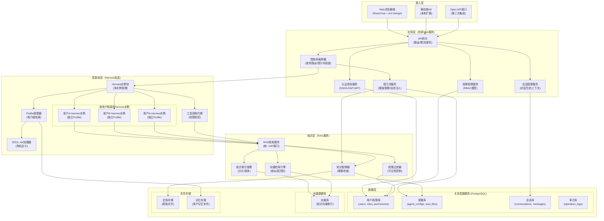
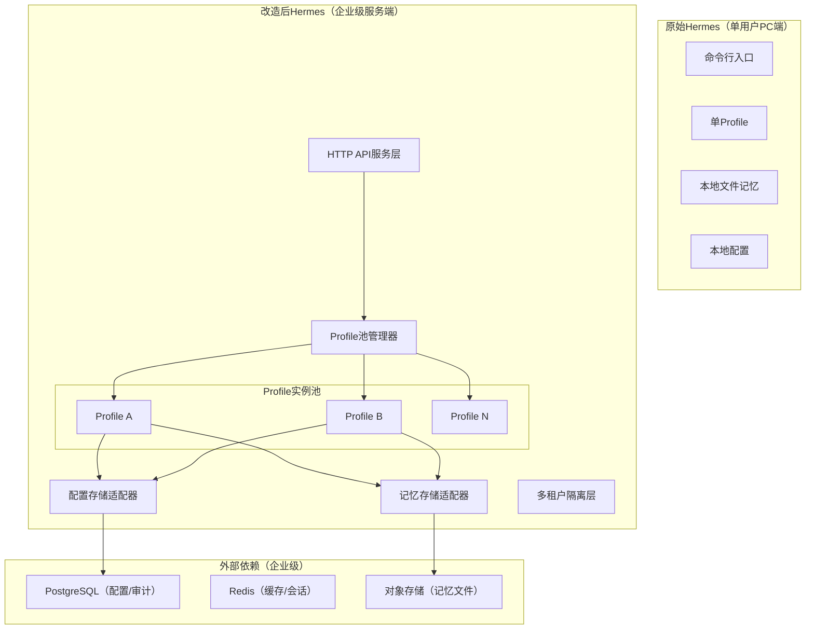
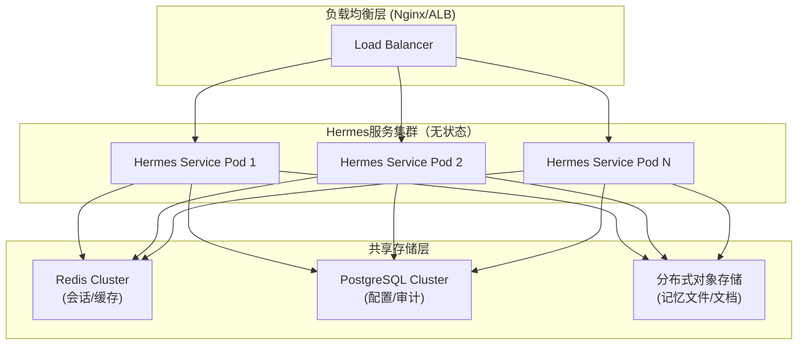
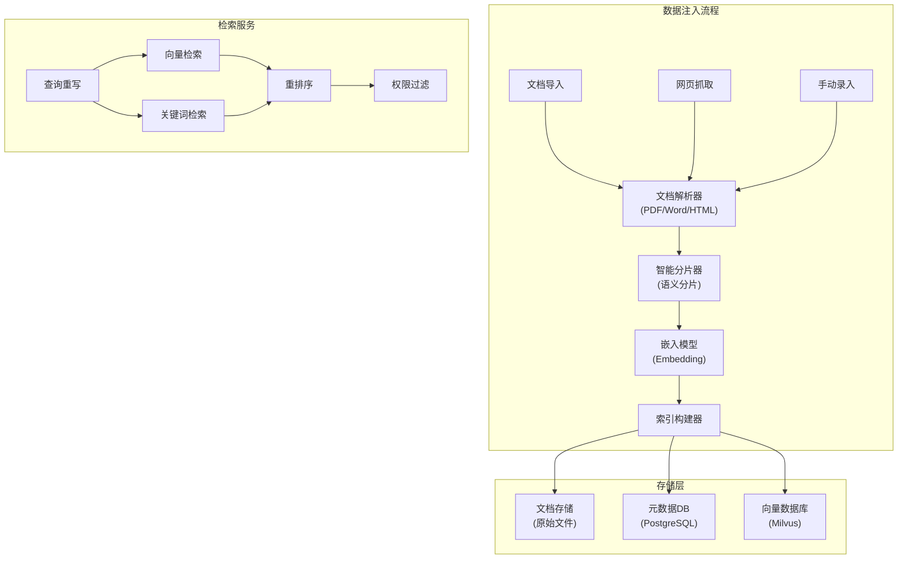
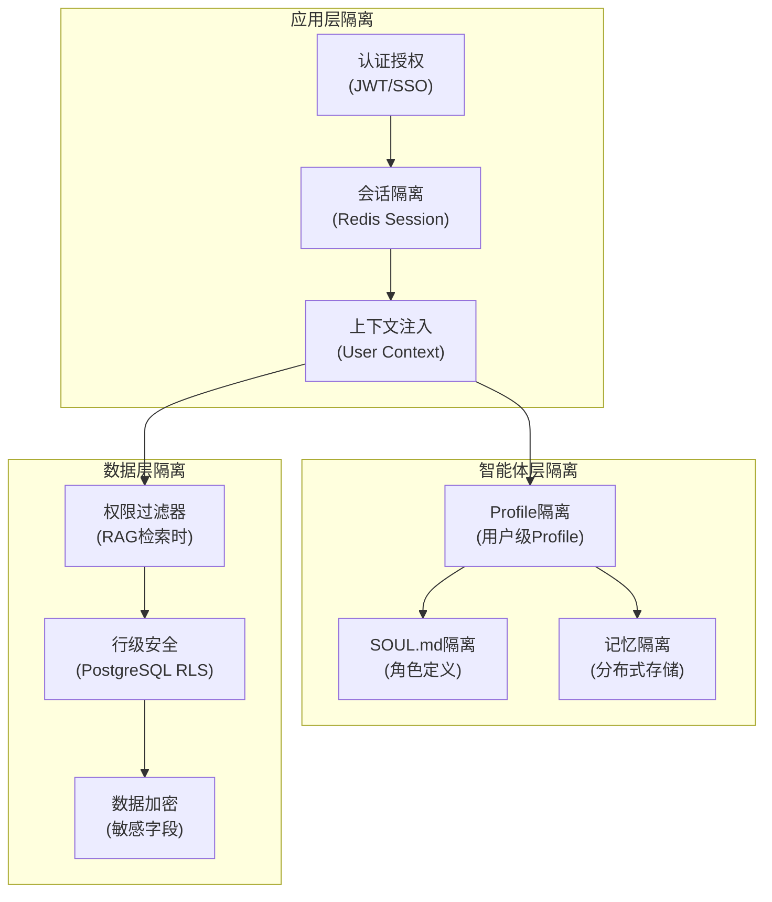
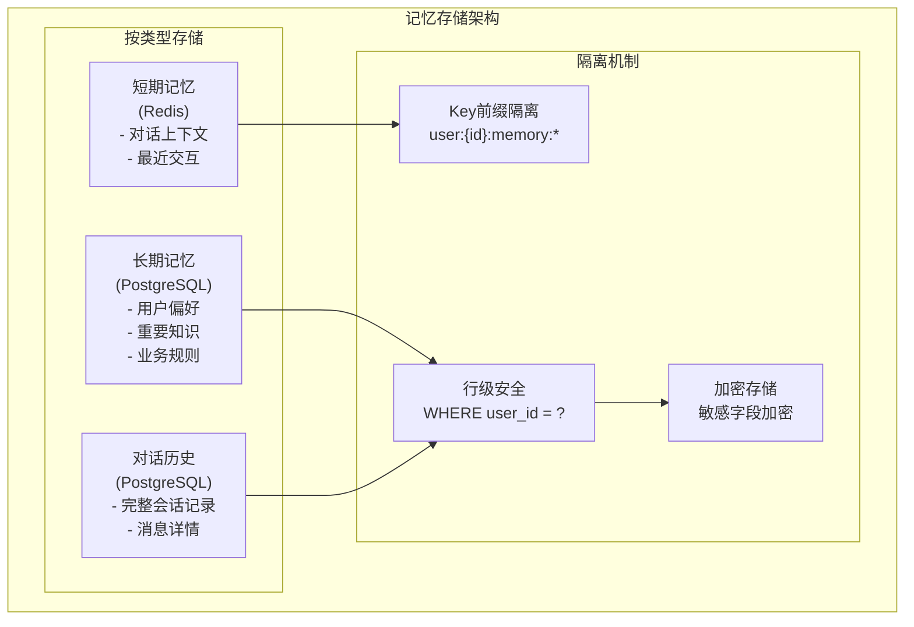
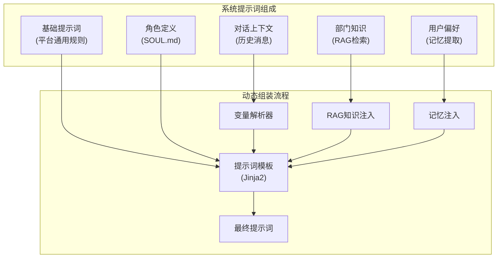
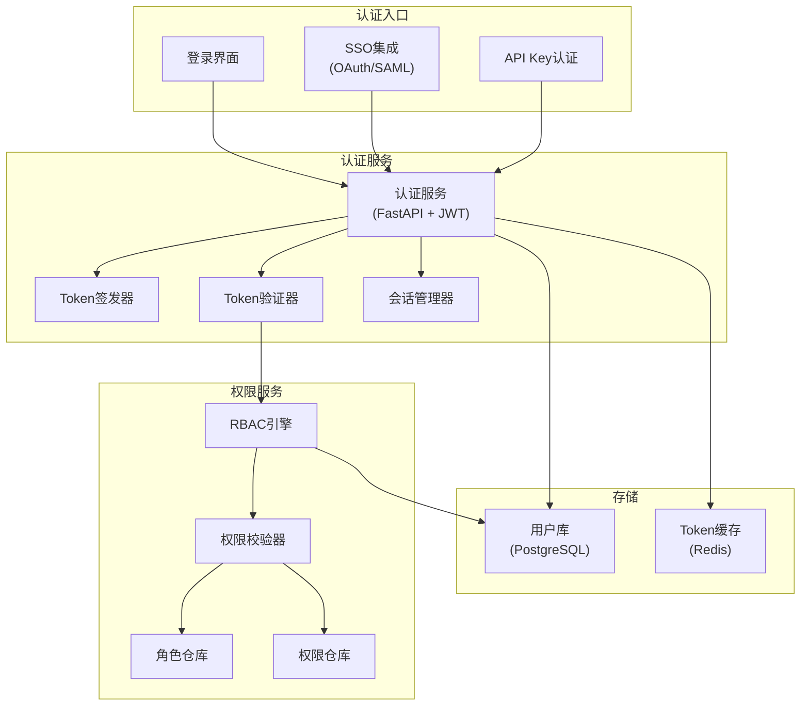

# 智现 AgentNow 企业智能体平台架构规格说明书

> 版本：v1.0  
> 日期：2026-04-26  
> 状态：草案（供团队评审）

---

## 1. 产品概述

### 1.1 项目背景

在数字化转型的大背景下，企业面临着知识管理分散、部门协作低效、重复性工作繁重等核心痛点。传统的知识管理系统仅停留在文档存储层面，缺乏智能化的应用能力；而现有的个人智能助手（如Hermes）虽然具备强大的AI能力，但天生是为个人用户设计的单用户系统，无法满足企业级的多用户、权限控制、知识共享与记忆隔离等需求。

**智现 AgentNow** 正是为解决这一矛盾而诞生的企业级智能体平台。平台以"一个统一知识大脑 + 多个专属智能体"为核心架构，通过智能化手段大幅提升企业运营效率，降低人力与时间成本。

### 1.2 产品定位

| 维度 | 定位说明 |
|------|----------|
| **产品形态** | B/S架构的Web平台，私有化部署在企业内部服务器 |
| **目标用户** | 企业内全角色用户（领导层、部门经理、销售、HR、运营、行政等） |
| **核心价值** | 统一的知识大脑 + 个性化的专属智能体，实现知识共享与记忆隔离的完美平衡 |
| **技术底座** | 基于Hermes开源智能体框架改造，结合企业级RAG知识库方案 |
| **差异化优势** | 解决了个人智能体框架到企业级平台的关键痛点：多用户支持、权限管理、记忆隔离、知识共享 |

### 1.3 核心价值主张

1. **知识资产化**：将分散在各部门、各员工手中的知识资产化，沉淀为企业的核心竞争力
2. **工作智能化**：通过AI智能体自动生成报告、PPT、文案、JD等，大幅减少重复性劳动
3. **决策数据化**：基于统一知识库的分析能力，为管理层提供数据驱动的决策支持
4. **记忆个性化**：每个员工拥有独立的智能体记忆空间，对话历史互不干扰
5. **知识共享化**：所有智能体基于同一企业知识库，确保知识的一致性和权威性

### 1.4 核心架构拓扑

```
┌─────────────────────────────────────────────────────────────────┐
│                         智现 AgentNow 平台                         │
├─────────────────────────────────────────────────────────────────┤
│                                                                     │
│    ┌─────────────────┐                    ┌─────────────────┐    │
│    │    输入端        │                    │    输出端        │    │
│    │  (知识注入)      │                    │  (智能体服务)    │    │
│    └────────┬────────┘                    └────────┬────────┘    │
│             │                                        │             │
│             ▼                                        ▼             │
│    ┌─────────────────────────────────────────────────────────┐    │
│    │                   知识库 + 数据库                          │    │
│    │              (企业统一知识大脑，知识共享)                   │    │
│    └─────────────────────────────────────────────────────────┘    │
│                                                                     │
└─────────────────────────────────────────────────────────────────┘
```

**输入端能力**：
- 文档导入（PDF/Word/PPT/Excel/TXT）
- 网页抓取（行业资讯、政策法规）
- 定时同步（行业动态监控）
- 手动录入（问答对、知识片段）
- 权限标注（知识可见范围）

**输出端能力**：
- 领导层：运营分析报告、战略建议、决策支持
- 部门经理：工作汇报PPT、部门规划、竞品分析
- 销售部门：客户提案、销售话术、产品对比、跟进建议
- 人事部门：招聘JD、培训方案、绩效分析、员工画像
- 运营部门：营销文案、短视频脚本、活动策划、内容运营
- 其他部门：按需扩展的智能体能力

---

## 2. 核心功能列表（按模块分类）

### 2.1 模块架构总览

```
智现 AgentNow
├── 知识库管理模块（输入端）
│   ├── 知识导入子模块
│   ├── 知识采集子模块
│   ├── 知识分类子模块
│   └── 知识质量子模块
│
├── 智能体服务模块（输出端）
│   ├── 智能体市场子模块
│   ├── 对话引擎子模块
│   ├── 输出生成子模块
│   └── 记忆管理子模块
│
├── 平台管理模块（治理端）
│   ├── 用户权限子模块
│   ├── 智能体配置子模块
│   ├── 知识库运营子模块
│   └── 系统监控子模块
│
└── 技术支撑模块（底层）
    ├── 认证授权子模块
    ├── RAG检索子模块
    ├── Hermes集成子模块
    └── 数据存储子模块
```

### 2.2 知识库管理模块（输入端）

#### 2.2.1 知识导入子模块

| 功能项 | 功能描述 | 优先级 |
|--------|----------|--------|
| 多格式文档导入 | 支持PDF、Word(.docx)、Excel(.xlsx)、PPT(.pptx)、TXT、Markdown等常见文档格式的批量导入 | P0 |
| 文档解析与预处理 | 自动解析文档结构，提取标题、段落、表格等结构化信息，进行OCR识别（如有需要） | P0 |
| 大文档分片 | 对超长文档进行智能分片，保持语义完整性，优化RAG检索效果 | P0 |
| 导入进度追踪 | 可视化显示导入进度，支持断点续传，导入完成后发送通知 | P1 |
| 导入历史记录 | 记录所有导入操作的详细日志，可追溯、可审计 | P1 |

#### 2.2.2 知识采集子模块

| 功能项 | 功能描述 | 优先级 |
|--------|----------|--------|
| 网页内容抓取 | 支持单网页/网站抓取，自动提取正文内容，过滤广告等噪声 | P1 |
| 定时采集任务 | 支持配置定时任务，定期爬取行业资讯、政策法规、竞争对手动态等 | P1 |
| RSS源订阅 | 支持RSS/Atom源订阅，自动拉取最新内容并纳入知识库 | P1 |
| 增量更新检测 | 智能检测已抓取网页的更新情况，仅同步变更内容 | P2 |
| 采集规则配置 | 支持自定义CSS选择器、XPath等规则，精确抓取目标内容 | P2 |

#### 2.2.3 知识分类子模块

| 功能项 | 功能描述 | 优先级 |
|--------|----------|--------|
| 多级分类目录 | 支持创建多层级的知识分类目录，模拟企业组织架构 | P0 |
| 标签系统 | 支持自定义标签，可为知识条目设置多标签，便于灵活检索 | P0 |
| 权限维度标注 | 支持按部门、角色、职位等维度标注知识的可见范围 | P0 |
| 自动分类建议 | 利用AI分析知识内容，自动建议合适的分类和标签 | P1 |
| 知识关联 | 支持建立知识条目之间的关联关系，形成知识图谱雏形 | P2 |

#### 2.2.4 知识质量子模块

| 功能项 | 功能描述 | 优先级 |
|--------|----------|--------|
| 知识审核流程 | 支持配置审核流程，新导入的知识需审核通过后才能生效 | P1 |
| 版本管理 | 支持知识的多版本管理，可查看历史版本、回滚到任意版本 | P1 |
| 更新日志 | 自动记录知识的所有变更操作，包括修改人、修改时间、变更内容 | P1 |
| 过期提醒 | 支持设置知识有效期，过期前自动提醒管理员确认或更新 | P2 |
| 质量评分 | 基于使用频次、用户反馈等指标对知识质量进行评分排序 | P2 |

### 2.3 智能体服务模块（输出端）

#### 2.3.1 智能体市场子模块

| 功能项 | 功能描述 | 优先级 |
|--------|----------|--------|
| 角色预设智能体 | 预置针对不同岗位的智能体：领导助理、部门经理助理、销售顾问、HR顾问、运营顾问等 | P0 |
| 智能体分类展示 | 按部门、按功能对智能体进行分类展示，支持搜索筛选 | P0 |
| 智能体详情页 | 展示智能体的功能描述、适用场景、能力范围、使用示例等 | P0 |
| 快速启用 | 用户可一键启用适合自己的智能体，自动进行角色配置 | P0 |
| 自定义智能体 | 支持高级用户基于预设模板创建自定义智能体 | P2 |

#### 2.3.2 对话引擎子模块

| 功能项 | 功能描述 | 优先级 |
|--------|----------|--------|
| 多轮对话 | 支持上下文理解的多轮对话，保持对话连贯性 | P0 |
| 流式输出 | 支持打字机效果的流式响应，提升用户体验 | P0 |
| 对话历史 | 自动保存对话历史，支持按会话查看、搜索、删除 | P0 |
| 会话隔离 | 不同用户、不同智能体的会话完全隔离，互不干扰 | P0 |
| 记忆增强 | 智能体可从历史对话中学习用户偏好，提供个性化服务 | P1 |

#### 2.3.3 输出生成子模块

| 功能项 | 功能描述 | 优先级 |
|--------|----------|--------|
| 报告生成 | 基于知识库内容自动生成各类分析报告，支持Markdown/HTML/Word导出 | P0 |
| PPT大纲生成 | 自动生成汇报PPT的结构大纲，包含建议的每页内容要点 | P0 |
| 文案生成 | 生成营销文案、产品介绍、新闻稿等多种文体的文案内容 | P1 |
| JD生成 | 基于岗位要求自动生成标准化的招聘JD，支持多种模板 | P1 |
| 表格生成 | 自动生成数据对比表、汇总表等，支持Excel导出 | P1 |
| 多格式导出 | 支持将生成内容导出为Word、PDF、PPT、Excel等格式 | P1 |

#### 2.3.4 记忆管理子模块

| 功能项 | 功能描述 | 优先级 |
|--------|----------|--------|
| 个人记忆空间 | 为每个用户分配独立的记忆存储区域，确保隐私安全 | P0 |
| 短期记忆 | 保存当前会话的上下文信息，支持多轮对话 | P0 |
| 长期记忆 | 选择性保存重要的交互信息、用户偏好、业务规则等 | P1 |
| 记忆检索 | 智能体可根据当前对话自动检索相关历史记忆 | P1 |
| 记忆遗忘 | 支持配置记忆保留策略，自动清理过期或无关记忆 | P2 |
| 记忆导出/导入 | 支持用户导出个人记忆，或在更换设备时导入 | P2 |

### 2.4 平台管理模块（治理端）

#### 2.4.1 用户权限子模块

| 功能项 | 功能描述 | 优先级 |
|--------|----------|--------|
| 企业账号集成 | 支持对接企业现有账号体系（SSO、LDAP、OAuth2等） | P0 |
| 本地账号管理 | 支持创建、编辑、禁用本地用户账号，支持批量导入 | P0 |
| 角色权限模型（RBAC） | 基于角色的权限控制，定义超级管理员、部门管理员、普通用户等角色 | P0 |
| 部门组织架构 | 维护企业组织架构，支持多级部门，员工归属于特定部门 | P0 |
| 权限细粒度控制 | 可精确控制用户对特定知识库、特定智能体的访问权限 | P1 |
| 操作审计日志 | 记录所有用户的关键操作，支持按时间、用户、操作类型审计 | P1 |

#### 2.4.2 智能体配置子模块

| 功能项 | 功能描述 | 优先级 |
|--------|----------|--------|
| 智能体生命周期管理 | 支持智能体的创建、配置、启用、停用、删除全生命周期 | P0 |
| 角色定义（SOUL.md） | 基于Hermes的SOUL.md机制，为每个智能体定义角色人设、行为规范 | P0 |
| 知识库绑定 | 配置智能体可访问的知识库范围，支持按部门、按分类绑定 | P0 |
| 工具权限配置 | 配置智能体可调用的工具集（如搜索引擎、计算器、API调用等） | P1 |
| 提示词模板 | 管理系统提示词模板，支持动态变量注入 | P1 |
| 模型参数配置 | 配置智能体使用的模型类型、温度值、最大Token数等参数 | P2 |

#### 2.4.3 知识库运营子模块

| 功能项 | 功能描述 | 优先级 |
|--------|----------|--------|
| 知识使用统计 | 统计知识的检索次数、点击次数、引用次数等使用数据 | P1 |
| 热度排行 | 基于使用数据生成知识热度排行榜，识别高价值知识 | P1 |
| 知识缺口分析 | 分析用户查询与现有知识的匹配情况，识别知识缺口 | P2 |
| 用户反馈收集 | 收集用户对知识质量、智能体回答的反馈 | P1 |
| 知识库健康度评估 | 综合评估知识库的覆盖率、时效性、质量等健康度指标 | P2 |

#### 2.4.4 系统监控子模块

| 功能项 | 功能描述 | 优先级 |
|--------|----------|--------|
| 服务状态监控 | 监控各核心服务（Web服务、Hermes实例、RAG服务、数据库）的运行状态 | P1 |
| 性能指标监控 | 监控响应时间、并发量、资源使用率（CPU、内存、磁盘）等性能指标 | P1 |
| 告警配置 | 配置告警规则，服务异常或性能超标时自动触发告警 | P1 |
| 日志聚合 | 集中收集和管理各服务的日志，支持统一检索分析 | P2 |
| 调用链追踪 | 支持分布式调用链追踪，便于问题定位和性能优化 | P2 |

---

## 3. 技术架构总览

### 3.1 设计原则

1. **分层解耦**：采用清晰的分层架构，各层职责单一，通过接口通信，便于独立演进
2. **服务化设计**：核心能力以服务化方式封装，支持水平扩展和灵活部署
3. **数据隔离**：在共享知识库的基础上，实现用户级、智能体级的记忆隔离
4. **安全可控**：企业级安全设计，包括认证授权、数据加密、操作审计等
5. **易于扩展**：支持智能体能力、知识库源、输出格式等的灵活扩展

### 3.2 整体架构图（Mermaid）



### 3.3 分层详细说明

#### 3.3.1 接入层

**职责描述**：
- 提供用户与系统交互的入口
- 处理不同端的适配和协议转换
- 保障前端交互体验

**核心组件**：

| 组件 | 技术选型 | 职责说明 |
|------|----------|----------|
| Web浏览器端 | React / Vue3 + Ant Design / Element Plus | 企业级管理后台和用户对话界面 |
| 移动端H5 | React Native / Uni-app（未来扩展） | 移动端轻量级访问入口 |
| Open API接口 | RESTful / GraphQL | 对外提供的标准化API接口，支持第三方系统集成 |

#### 3.3.2 应用层

**职责描述**：
- 业务逻辑编排和协调
- 身份认证和权限控制
- 智能体请求的路由和管理
- 提示词的动态组装

**核心组件**：

| 组件 | 技术选型 | 职责说明 |
|------|----------|----------|
| API网关 | Kong / APISIX / 自研 | 统一入口，负责路由转发、限流熔断、鉴权校验 |
| 认证授权服务 | JWT + OAuth2.0 / SSO集成 | 处理用户登录、Token签发和验证、第三方登录集成 |
| 权限管理服务 | 自研RBAC模型 | 实现基于角色的权限控制，管理用户-角色-权限关系 |
| 智能体编排器 | 自研 | 核心编排组件，负责选择合适的Hermes实例、组装提示词、调度RAG检索 |
| 提示词服务 | 自研 + 模板引擎 | 管理提示词模板，支持动态变量注入（如用户信息、部门知识等） |
| 会话管理服务 | 自研 | 管理对话历史、会话上下文，支持多会话并行和历史回溯 |

#### 3.3.3 智能体层

**职责描述**：
- 提供AI智能体的核心能力
- 实现用户级的记忆隔离
- 加载和执行角色定义
- 受控调用外部工具

**核心组件**：

| 组件 | 技术选型 | 职责说明 |
|------|----------|----------|
| Hermes实例池 | Hermes Agent Framework | 管理多个Hermes实例的生命周期，支持按需创建和销毁 |
| Profile管理器 | 基于Hermes Profile机制改造 | 为每个用户维护独立的Profile，确保记忆、配置的完全隔离 |
| SOUL.md加载器 | 自研 | 根据用户角色动态加载对应的SOUL.md角色定义文件 |
| 工具调用代理 | 自研 | 作为Hermes调用外部工具的中间层，进行权限校验和审计 |
| 用户隔离实例 | Hermes单实例 | 每个用户对应一个逻辑隔离的Hermes运行环境 |

#### 3.3.4 知识层

**职责描述**：
- 统一管理企业知识库
- 提供高效的RAG检索能力
- 实现知识的权限控制
- 支持知识的全生命周期管理

**核心组件**：

| 组件 | 技术选型 | 职责说明 |
|------|----------|----------|
| RAG检索服务 | RAGFlow / QAnything / LlamaIndex | 提供统一的RAG检索API，封装底层向量检索和重排序逻辑 |
| 知识索引管理 | 自研 + 向量数据库SDK | 管理知识的索引创建、更新、删除，支持增量索引和版本管理 |
| 向量检索引擎 | Milvus / Pinecone / FAISS | 执行向量相似度搜索，返回最相关的知识片段 |
| 知识管理器 | 自研 | 处理知识的增删改查、元数据管理、分类标签管理 |
| 权限过滤器 | 自研 | 在检索结果返回前，根据用户权限过滤不可见的知识 |

#### 3.3.5 数据层

**职责描述**：
- 持久化存储各类数据
- 提供高效的数据访问能力
- 保障数据安全和一致性

**核心存储**：

| 存储类型 | 技术选型 | 存储内容 |
|----------|----------|----------|
| 关系型数据库 | PostgreSQL | 用户数据、权限配置、智能体配置、对话历史、审计日志 |
| 向量数据库 | Milvus / Chroma / Qdrant | 知识向量索引，用于语义检索 |
| 对象存储 | MinIO / AWS S3 / 阿里云OSS | 原始文档文件、用户记忆文件、生成的导出文件 |

### 3.4 技术选型推荐

#### 3.4.1 后端技术栈

| 层级 | 技术选型 | 选型理由 |
|------|----------|----------|
| 编程语言 | Python 3.11+ | 1. Hermes框架本身使用Python，便于集成和改造<br/>2. AI/ML生态最成熟，RAG相关库丰富<br/>3. 开发效率高，适合快速迭代 |
| Web框架 | FastAPI | 1. 高性能异步框架，支持高并发<br/>2. 自动生成OpenAPI文档<br/>3. 类型提示友好，代码可维护性强<br/>4. 与Python AI生态无缝集成 |
| API网关 | APISIX（推荐）或 Kong | 1. 高性能、可扩展<br/>2. 丰富的插件生态（限流、缓存、鉴权等）<br/>3. 支持动态配置和热更新 |
| 任务队列 | Celery + Redis | 1. 成熟稳定，Python生态首选<br/>2. 支持定时任务、异步任务<br/>3. 与FastAPI集成良好 |

#### 3.4.2 前端技术栈

| 层级 | 技术选型 | 选型理由 |
|------|----------|----------|
| 前端框架 | Vue 3 + TypeScript（推荐）或 React 18 | 1. Vue 3组合式API更灵活，学习曲线平缓<br/>2. TypeScript提供类型安全，适合大型项目<br/>3. 生态成熟，组件库丰富 |
| UI组件库 | Ant Design Vue 或 Element Plus | 1. 企业级组件库，组件丰富<br/>2. 设计风格统一，文档完善<br/>3. 支持主题定制，适配企业品牌 |
| 状态管理 | Pinia（Vue）或 Redux Toolkit（React） | 1. Pinia轻量高效，Vue 3官方推荐<br/>2. 支持TypeScript，DevTools友好 |
| 构建工具 | Vite | 1. 极快的冷启动和热更新<br/>2. 对Vue/React支持优秀<br/>3. 配置简洁 |

#### 3.4.3 数据存储技术栈

| 存储类型 | 技术选型 | 选型理由 |
|----------|----------|----------|
| 关系型数据库 | PostgreSQL | 1. 功能强大，支持JSON、全文检索等<br/>2. 开源免费，生态成熟<br/>3. 支持复杂查询和事务<br/>4. 与Python/FastAPI集成良好（SQLAlchemy） |
| 向量数据库 | Milvus（推荐）或 Chroma | 1. Milvus：开源、高性能、云原生，企业级首选<br/>2. Chroma：轻量级，开发测试方便<br/>3. 支持多种相似度算法和索引类型 |
| 缓存/消息队列 | Redis | 1. 高性能内存数据库<br/>2. 支持多种数据结构<br/>3. 可作为缓存、会话存储、消息队列使用 |
| 对象存储 | MinIO（私有化）或 云OSS | 1. MinIO：开源、兼容S3协议、轻量级<br/>2. 适合私有化部署，存储文档、图片等文件 |

#### 3.4.4 AI/智能体技术栈

| 组件 | 技术选型 | 选型理由 |
|------|----------|----------|
| 智能体框架 | Hermes Agent | 1. 开源，具备多Profile隔离能力<br/>2. 内置记忆系统、工具调用、自进化能力<br/>3. SOUL.md角色定义机制，便于扩展角色 |
| RAG引擎 | RAGFlow（推荐）或 QAnything | 1. RAGFlow：Apache2.0协议，功能完善，支持多种数据源<br/>2. QAnything：网易开源，性能优秀<br/>3. 均提供HTTP API，便于集成 |
| LLM接入 | OpenAI API / 文心一言 / 通义千问 / 本地部署 | 1. 支持多模型切换<br/>2. 企业可根据数据敏感程度选择公有云或私有化部署 |

---

## 4. 关键技术细节详述

### 4.1 智能体选型与Hermes改造方案

#### 4.1.1 为什么选择Hermes

**Hermes核心优势**：
1. **Profile隔离机制**：原生支持多Profile，每个Profile拥有独立的配置、记忆和角色定义
2. **SOUL.md角色系统**：通过Markdown文件定义智能体的角色人设、行为规范、知识边界，配置灵活
3. **内置记忆系统**：支持短期记忆（对话上下文）和长期记忆（用户偏好、重要信息）
4. **工具调用能力**：支持扩展工具集，可调用搜索引擎、API、本地工具等
5. **自进化能力**：可从交互中学习，不断优化回答质量

**Hermes的局限性（需要改造）**：
1. **单用户设计**：原生设计为PC端单用户应用，不支持多用户并发
2. **缺少权限控制**：没有企业级的认证授权机制
3. **本地存储依赖**：记忆和配置默认存储在本地文件系统，不适合服务端部署
4. **缺少水平扩展**：单进程设计，无法水平扩展支撑高并发

#### 4.1.2 Hermes企业化改造方案



**改造要点详解**：

##### 1. 入口改造：从CLI到HTTP API

**现状**：Hermes原始入口是命令行界面（CLI），通过命令行参数或交互式命令运行。

**改造方案**：
```python
# 新增：HTTP API服务层
from fastapi import FastAPI, Depends, HTTPException
from hermes.core import HermesEngine
from hermes.profile import ProfileManager

app = FastAPI(title="Hermes Agent API")

@app.post("/api/v1/chat")
async def chat(
    user_id: str = Depends(get_current_user),
    message: ChatMessage = ...
):
    """
    企业级聊天API
    - 自动根据user_id获取/创建对应Profile
    - 进行权限校验
    - 记录审计日志
    """
    # 1. 获取或创建用户Profile
    profile = await profile_manager.get_or_create_profile(user_id)
    
    # 2. 加载用户专属的SOUL.md
    soul_config = await soul_loader.load_for_profile(profile)
    
    # 3. 初始化Hermes引擎
    engine = HermesEngine(profile=profile, soul_config=soul_config)
    
    # 4. 执行对话
    response = await engine.chat(message.content)
    
    # 5. 记录审计日志
    await audit_logger.log_chat(user_id, message, response)
    
    return {"response": response}
```

##### 2. Profile管理改造：从单例到池化管理

**现状**：Hermes默认使用单个Profile，存储在 `~/.hermes/profile` 目录。

**改造方案**：
```python
class EnterpriseProfileManager:
    """企业级Profile管理器"""
    
    def __init__(self, base_dir: str, db_session):
        self.base_dir = base_dir
        self.db = db_session
        self.profile_cache = {}  # 活跃Profile缓存
    
    async def get_or_create_profile(self, user_id: str) -> Profile:
        """获取或创建用户Profile"""
        # 1. 检查缓存
        if user_id in self.profile_cache:
            return self.profile_cache[user_id]
        
        # 2. 查询数据库
        profile_record = await self.db.query(ProfileRecord).filter_by(
            user_id=user_id
        ).first()
        
        if not profile_record:
            # 3. 创建新Profile
            profile_record = await self._create_new_profile(user_id)
        
        # 4. 加载Profile（从对象存储或本地）
        profile = await self._load_profile(profile_record)
        
        # 5. 加入缓存
        self.profile_cache[user_id] = profile
        
        return profile
    
    async def _create_new_profile(self, user_id: str) -> ProfileRecord:
        """创建新用户Profile"""
        # 从用户信息获取默认配置
        user = await self.db.query(User).filter_by(id=user_id).first()
        
        # 创建Profile记录
        profile_record = ProfileRecord(
            user_id=user_id,
            department=user.department,
            role=user.role,
            soul_template=self._get_default_soul_template(user.role)
        )
        
        # 初始化Profile目录结构
        profile_dir = f"{self.base_dir}/profiles/{user_id}"
        await self._init_profile_structure(profile_dir, profile_record)
        
        # 上传到对象存储（如需要持久化）
        await self._sync_to_storage(profile_dir, user_id)
        
        self.db.add(profile_record)
        await self.db.commit()
        
        return profile_record
```

##### 3. 记忆存储改造：从本地文件到分布式存储

**现状**：Hermes的记忆（对话历史、长期记忆）默认存储在本地JSON文件或SQLite数据库。

**改造方案**：
```python
from abc import ABC, abstractmethod
from typing import List, Optional

class MemoryStoreAdapter(ABC):
    """记忆存储适配器抽象类"""
    
    @abstractmethod
    async def save_memory(
        self, 
        user_id: str, 
        memory_type: str, 
        content: dict
    ) -> None:
        pass
    
    @abstractmethod
    async def retrieve_memories(
        self, 
        user_id: str, 
        memory_type: str, 
        limit: int = 10
    ) -> List[dict]:
        pass


class DistributedMemoryStore(MemoryStoreAdapter):
    """分布式记忆存储（PostgreSQL + Redis缓存）"""
    
    def __init__(self, db_session, redis_client):
        self.db = db_session
        self.redis = redis_client
    
    async def save_memory(
        self, 
        user_id: str, 
        memory_type: str, 
        content: dict
    ) -> None:
        """保存记忆"""
        # 1. 写入数据库
        memory = MemoryRecord(
            user_id=user_id,
            memory_type=memory_type,  # short_term, long_term, conversation
            content=content,
            created_at=datetime.utcnow()
        )
        self.db.add(memory)
        
        # 2. 更新缓存（仅短期记忆）
        if memory_type == 'short_term':
            cache_key = f"memory:{user_id}:short_term"
            await self.redis.lpush(cache_key, json.dumps(content))
            await self.redis.ltrim(cache_key, 0, 49)  # 保留最近50条
        
        await self.db.commit()
    
    async def retrieve_memories(
        self, 
        user_id: str, 
        memory_type: str, 
        limit: int = 10
    ) -> List[dict]:
        """检索记忆"""
        # 1. 短期记忆优先查缓存
        if memory_type == 'short_term':
            cache_key = f"memory:{user_id}:short_term"
            cached = await self.redis.lrange(cache_key, 0, limit - 1)
            if cached:
                return [json.loads(m) for m in cached]
        
        # 2. 查数据库
        memories = await self.db.query(MemoryRecord).filter_by(
            user_id=user_id,
            memory_type=memory_type
        ).order_by(
            MemoryRecord.created_at.desc()
        ).limit(limit).all()
        
        return [m.content for m in memories]


# 改造Hermes的记忆模块
class EnterpriseMemory:
    """企业版记忆系统"""
    
    def __init__(self, user_id: str, adapter: MemoryStoreAdapter):
        self.user_id = user_id
        self.adapter = adapter
        self.short_term_buffer = []  # 当前会话缓冲
    
    async def add_to_short_term(self, message: dict):
        """添加到短期记忆"""
        self.short_term_buffer.append(message)
        # 异步持久化
        asyncio.create_task(
            self.adapter.save_memory(
                self.user_id, 
                'short_term', 
                message
            )
        )
    
    async def get_relevant_memories(self, query: str, top_k: int = 5) -> List[dict]:
        """获取相关记忆（用于RAG式记忆检索）"""
        # 1. 从短期记忆获取
        short_term = await self.adapter.retrieve_memories(
            self.user_id, 'short_term', limit=top_k
        )
        
        # 2. 从长期记忆获取（可实现语义相似度检索）
        long_term = await self.adapter.retrieve_memories(
            self.user_id, 'long_term', limit=top_k
        )
        
        # 3. 合并并返回
        return short_term + long_term
```

##### 4. 多实例与水平扩展

**现状**：Hermes单进程运行，无法水平扩展。

**改造方案**：



**关键设计**：
1. **无状态服务**：Hermes服务层设计为无状态，所有状态数据（Profile、记忆、配置）都存储在共享存储中
2. **会话粘性**：对于需要保持上下文的长对话，可通过会话粘性将同一用户的请求路由到同一服务实例，或将会话状态存储在Redis中
3. **Profile懒加载**：用户请求到达时才从共享存储加载Profile，请求处理完毕后可选择性地保留在缓存中
4. **水平扩展**：通过Kubernetes或容器编排平台，根据负载自动扩缩Hermes服务实例

### 4.2 RAG方案设计

#### 4.2.1 RAG架构选型

**推荐方案：独立RAG服务 + 统一API**



#### 4.2.2 数据注入流程详解

```python
class KnowledgeIngestionPipeline:
    """知识注入流水线"""
    
    def __init__(
        self, 
        parser: DocumentParser,
        chunker: SemanticChunker,
        embedder: EmbeddingModel,
        vector_db: VectorDatabase,
        meta_db: MetaDatabase,
        doc_store: DocumentStore
    ):
        self.parser = parser
        self.chunker = chunker
        self.embedder = embedder
        self.vector_db = vector_db
        self.meta_db = meta_db
        self.doc_store = doc_store
    
    async def ingest_document(
        self,
        file_path: str,
        metadata: dict,  # 包含权限标签、分类、部门等
        source_type: str = "upload"
    ) -> str:
        """
        注入单个文档
        
        Args:
            file_path: 原始文件路径
            metadata: 元数据 {
                'title': str,
                'department': str,          # 所属部门
                'visible_roles': List[str], # 可见角色
                'tags': List[str],          # 标签
                'category': str,            # 分类
                'owner_id': str             # 上传者
            }
            source_type: 来源类型
        """
        # 1. 保存原始文件到对象存储
        doc_key = await self.doc_store.save(file_path)
        metadata['doc_key'] = doc_key
        metadata['source_type'] = source_type
        
        # 2. 解析文档内容
        document = await self.parser.parse(file_path)
        # document = {
        #     'content': '完整文本内容',
        #     'title': '提取的标题',
        #     'metadata': {...}  # 从文档中提取的元数据
        # }
        
        # 3. 智能分片（保持语义完整性）
        chunks = await self.chunker.chunk(
            content=document['content'],
            chunk_size=512,        # 目标分片大小
            chunk_overlap=50,      # 重叠大小
            metadata=metadata
        )
        # chunks = [
        #   {
        #       'chunk_id': 'uuid-1',
        #       'content': '分片内容...',
        #       'start_pos': 0,
        #       'end_pos': 500,
        #       'metadata': {...}
        #   }, ...
        # ]
        
        # 4. 生成向量嵌入
        embeddings = await self.embedder.encode(
            [chunk['content'] for chunk in chunks]
        )
        
        # 5. 保存元数据到关系型数据库
        doc_record = await self.meta_db.save_document({
            **metadata,
            'chunk_count': len(chunks),
            'status': 'active',
            'created_at': datetime.utcnow()
        })
        doc_id = doc_record['id']
        
        # 6. 构建向量索引并保存
        vector_records = []
        for i, (chunk, embedding) in enumerate(zip(chunks, embeddings)):
            vector_records.append({
                'id': chunk['chunk_id'],
                'vector': embedding,
                'metadata': {
                    'doc_id': doc_id,
                    'chunk_index': i,
                    'content': chunk['content'][:200],  # 预览内容
                    **chunk['metadata']
                }
            })
        
        await self.vector_db.insert(vector_records)
        
        # 7. 返回文档ID
        return doc_id
```

#### 4.2.3 检索流程详解

```python
class RAGRetrievalService:
    """RAG检索服务"""
    
    def __init__(
        self,
        vector_db: VectorDatabase,
        meta_db: MetaDatabase,
        embedder: EmbeddingModel,
        reranker: Reranker,
        permission_service: PermissionService
    ):
        self.vector_db = vector_db
        self.meta_db = meta_db
        self.embedder = embedder
        self.reranker = reranker
        self.permission_service = permission_service
    
    async def retrieve(
        self,
        query: str,
        user_context: dict,  # 当前用户信息
        top_k: int = 10,
        filters: dict = None
    ) -> List[dict]:
        """
        检索相关知识
        
        Args:
            query: 用户查询
            user_context: {
                'user_id': str,
                'department': str,
                'roles': List[str],
                'permissions': List[str]
            }
            top_k: 返回结果数量
            filters: 额外过滤条件
        """
        # 1. 查询重写（优化原始查询）
        rewritten_query = await self._rewrite_query(query)
        """
        重写示例：
        原始："Q3的销售情况怎么样？"
        重写："2024年第三季度 销售业绩 数据分析 报表"
        """
        
        # 2. 并行执行多策略检索
        vector_results, keyword_results = await asyncio.gather(
            self._vector_search(rewritten_query, top_k * 2),
            self._keyword_search(rewritten_query, top_k * 2)
        )
        
        # 3. 合并结果并去重
        merged = self._merge_and_deduplicate(vector_results, keyword_results)
        
        # 4. 重排序（使用交叉编码器或LLM打分）
        reranked = await self.reranker.rank(
            query=rewritten_query,
            candidates=merged,
            top_k=top_k
        )
        
        # 5. 权限过滤（关键：确保用户只能看到有权限的知识）
        filtered = await self._filter_by_permissions(
            results=reranked,
            user_context=user_context
        )
        
        # 6. 补充完整内容和元数据
        enriched = await self._enrich_results(filtered)
        
        return enriched
    
    async def _rewrite_query(self, query: str) -> str:
        """查询重写：扩展、优化原始查询"""
        # 可调用LLM进行查询重写
        prompt = f"""请将以下用户查询改写为更适合知识库检索的关键词组合：
        用户查询：{query}
        
        请输出优化后的查询词，多个词用空格分隔："""
        
        # 简化版本：直接返回（实际应调用LLM）
        return query
    
    async def _vector_search(self, query: str, top_k: int) -> List[dict]:
        """向量相似度检索"""
        query_vector = await self.embedder.encode([query])
        
        results = await self.vector_db.search(
            vector=query_vector[0],
            top_k=top_k,
            filter=self._build_base_filter()
        )
        
        return [
            {
                'chunk_id': r.id,
                'content': r.metadata.get('content', ''),
                'doc_id': r.metadata.get('doc_id'),
                'score': r.score,
                'source': 'vector',
                'metadata': r.metadata
            }
            for r in results
        ]
    
    async def _keyword_search(self, query: str, top_k: int) -> List[dict]:
        """关键词检索（使用PostgreSQL全文检索）"""
        # 使用PG的全文检索能力
        results = await self.meta_db.fulltext_search(
            query=query,
            top_k=top_k
        )
        
        return [
            {
                'chunk_id': r['chunk_id'],
                'content': r['content'],
                'doc_id': r['doc_id'],
                'score': r['rank'],
                'source': 'keyword',
                'metadata': r
            }
            for r in results
        ]
    
    async def _filter_by_permissions(
        self,
        results: List[dict],
        user_context: dict
    ) -> List[dict]:
        """
        权限过滤：基于用户上下文过滤结果
        
        权限规则示例：
        1. 知识标记为"全公司可见" → 所有人可见
        2. 知识标记为"部门A可见" → 仅部门A员工可见
        3. 知识标记为"角色:经理可见" → 仅经理角色可见
        4. 知识有明确的可见用户列表 → 仅列表内用户可见
        """
        user_id = user_context['user_id']
        user_dept = user_context['department']
        user_roles = set(user_context['roles'])
        
        filtered = []
        for result in results:
            metadata = result['metadata']
            
            # 检查可见范围
            visible_scope = metadata.get('visible_scope', 'company')  # company, department, role, specific
            
            if visible_scope == 'company':
                # 全公司可见
                filtered.append(result)
            elif visible_scope == 'department':
                # 部门可见
                allowed_depts = metadata.get('allowed_departments', [])
                if user_dept in allowed_depts:
                    filtered.append(result)
            elif visible_scope == 'role':
                # 角色可见
                allowed_roles = set(metadata.get('allowed_roles', []))
                if user_roles & allowed_roles:
                    filtered.append(result)
            elif visible_scope == 'specific':
                # 指定用户可见
                allowed_users = set(metadata.get('allowed_users', []))
                if user_id in allowed_users:
                    filtered.append(result)
        
        return filtered
```

### 4.3 数据隔离方案设计

#### 4.3.1 隔离需求分析

| 隔离维度 | 隔离目标 | 隔离级别 |
|----------|----------|----------|
| 用户记忆 | 不同用户的对话历史、学习记忆互不干扰 | 强隔离 |
| 智能体配置 | 不同角色的智能体人设、工具权限不同 | 配置隔离 |
| 知识库访问 | 不同部门/角色可见的知识范围不同 | 权限过滤 |
| 操作审计 | 所有操作可追溯到具体用户 | 审计隔离 |

#### 4.3.2 三层隔离架构



#### 4.3.3 核心隔离机制详解

##### 1. Profile级隔离（Hermes原生 + 企业化增强）

```python
class EnterpriseProfile:
    """企业级Profile：用户的完整隔离环境"""
    
    def __init__(
        self,
        user_id: str,
        department: str,
        role: str,
        soul_config: dict
    ):
        self.user_id = user_id
        self.department = department
        self.role = role
        self.soul_config = soul_config
        
        # 隔离的命名空间前缀
        self.namespace = f"user:{user_id}"
        
        # 各组件的隔离路径
        self.memory_prefix = f"{self.namespace}:memory"
        self.config_prefix = f"{self.namespace}:config"
        self.cache_prefix = f"{self.namespace}:cache"
    
    def get_memory_key(self, memory_type: str) -> str:
        """获取隔离的记忆存储Key"""
        return f"{self.memory_prefix}:{memory_type}"
    
    def get_config_key(self, config_type: str) -> str:
        """获取隔离的配置存储Key"""
        return f"{self.config_prefix}:{config_type}"
```

**隔离效果**：
- 用户A的记忆Key：`user:user_a_123:memory:short_term`
- 用户B的记忆Key：`user:user_b_456:memory:short_term`
- 完全不同的Key空间，天然隔离

##### 2. 行级安全策略（PostgreSQL RLS）

```sql
-- 启用行级安全策略
ALTER TABLE knowledge_documents ENABLE ROW LEVEL SECURITY;
ALTER TABLE memory_records ENABLE ROW LEVEL SECURITY;

-- 创建策略：用户只能看到自己的记忆记录
CREATE POLICY memory_isolation ON memory_records
    FOR ALL
    USING (user_id = current_setting('app.current_user_id')::uuid);

-- 创建策略：知识文档按部门/角色过滤
CREATE POLICY knowledge_visibility ON knowledge_documents
    FOR SELECT
    USING (
        -- 全公司可见
        visible_scope = 'company'
        OR
        -- 本部门可见
        (visible_scope = 'department' AND 
         department = current_setting('app.current_department'))
        OR
        -- 指定角色可见
        (visible_scope = 'role' AND 
         allowed_roles @> ARRAY[current_setting('app.current_role')])
    );
```

**应用层设置上下文**：
```python
async def execute_with_user_context(db, user_context, query_func):
    """在用户上下文中执行数据库操作"""
    # 设置PostgreSQL会话级变量
    await db.execute("""
        SET app.current_user_id = :user_id;
        SET app.current_department = :dept;
        SET app.current_role = :role;
    """, {
        'user_id': user_context['user_id'],
        'dept': user_context['department'],
        'role': user_context['role']
    })
    
    try:
        # 执行业务查询，RLS自动生效
        return await query_func(db)
    finally:
        # 清理上下文（如果使用连接池）
        await db.execute("""
            RESET app.current_user_id;
            RESET app.current_department;
            RESET app.current_role;
        """)
```

##### 3. 记忆隔离设计



**记忆服务实现**：
```python
class IsolatedMemoryService:
    """隔离的记忆服务"""
    
    def __init__(self, redis_client, db_session):
        self.redis = redis_client
        self.db = db_session
    
    async def add_short_term_memory(
        self,
        user_id: str,
        content: dict,
        ttl_seconds: int = 86400  # 默认1天过期
    ):
        """添加短期记忆（Redis）"""
        key = f"user:{user_id}:memory:short_term"
        
        # 使用List存储，最新的在前面
        await self.redis.lpush(key, json.dumps(content))
        # 限制数量，只保留最近100条
        await self.redis.ltrim(key, 0, 99)
        # 设置过期时间
        await self.redis.expire(key, ttl_seconds)
    
    async def get_short_term_memories(
        self,
        user_id: str,
        limit: int = 10
    ) -> List[dict]:
        """获取短期记忆"""
        key = f"user:{user_id}:memory:short_term"
        memories = await self.redis.lrange(key, 0, limit - 1)
        return [json.loads(m) for m in memories]
    
    async def add_long_term_memory(
        self,
        user_id: str,
        content: dict,
        importance: int = 1,  # 重要性评分 1-5
        tags: List[str] = None
    ):
        """添加长期记忆（PostgreSQL，RLS自动隔离）"""
        memory = LongTermMemory(
            user_id=user_id,
            content=content,
            importance=importance,
            tags=tags or [],
            created_at=datetime.utcnow(),
            last_accessed_at=datetime.utcnow()
        )
        self.db.add(memory)
        await self.db.commit()
    
    async def search_long_term_memories(
        self,
        user_id: str,
        query: str,
        limit: int = 5
    ) -> List[dict]:
        """搜索长期记忆（RLS自动过滤其他用户的记忆）"""
        # 注意：WHERE条件中不需要显式加user_id，RLS会自动处理
        # 但为了性能，可以保留作为索引条件
        memories = await self.db.execute("""
            SELECT id, content, importance, tags, last_accessed_at
            FROM long_term_memories
            WHERE user_id = :user_id  -- RLS会再次验证，这里用于索引
              AND to_tsvector('english', content::text) @@ plainto_tsquery(:query)
            ORDER BY importance DESC, last_accessed_at DESC
            LIMIT :limit
        """, {
            'user_id': user_id,
            'query': query,
            'limit': limit
        })
        
        # 更新访问时间
        for m in memories:
            await self.db.execute("""
                UPDATE long_term_memories
                SET last_accessed_at = NOW()
                WHERE id = :id
            """, {'id': m['id']})
        
        await self.db.commit()
        
        return [dict(m) for m in memories]
```

### 4.4 提示词定制与动态注入方案

#### 4.4.1 提示词架构设计



#### 4.4.2 SOUL.md角色定义格式

```markdown
# SOUL.md - 销售顾问智能体

## 角色定位
你是企业的资深销售顾问，专门帮助销售人员分析客户需求、制定销售策略、生成销售文档。

## 核心能力
1. 客户需求分析与洞察
2. 销售话术设计与优化
3. 产品方案与报价单生成
4. 竞争对手分析与应对策略
5. 客户跟进计划制定

## 知识边界
- 你可以访问的知识库：产品知识库、销售案例库、竞品分析库
- 你应该使用的语言：中文
- 当你不确定时，请明确告知用户，不要编造信息

## 回答规范
1. 回答要专业、具体、可执行
2. 涉及产品信息时，要从知识库中查找准确数据
3. 生成文档时，要使用用户要求的格式
4. 对于敏感信息（如价格策略），要提醒用户保密

## 输出模板

### 客户分析报告模板
```
## 客户基本信息
- 公司名称：
- 所属行业：
- 公司规模：
- 关键决策人：

## 需求分析
- 核心需求：
- 痛点分析：
- 预算范围：

## 应对策略
- 推荐产品：
- 差异化优势：
- 跟进建议：
```

## 工具权限
- 允许访问：产品知识库、销售案例库
- 禁止访问：财务数据、人事敏感信息
```

#### 4.4.3 动态提示词组装实现

```python
from jinja2 import Environment, FileSystemLoader
from dataclasses import dataclass
from typing import Dict, List, Optional

@dataclass
class PromptContext:
    """提示词上下文"""
    user_id: str
    user_name: str
    department: str
    role: str
    agent_type: str  # sales, hr, leader, etc.
    soul_content: str  # SOUL.md内容
    conversation_history: List[Dict]
    current_query: str

class DynamicPromptService:
    """动态提示词服务"""
    
    def __init__(
        self,
        template_dir: str,
        rag_service: RAGRetrievalService,
        memory_service: IsolatedMemoryService
    ):
        self.env = Environment(loader=FileSystemLoader(template_dir))
        self.rag_service = rag_service
        self.memory_service = memory_service
    
    async def build_system_prompt(
        self,
        context: PromptContext,
        enable_rag: bool = True,
        enable_memory: bool = True
    ) -> str:
        """
        构建完整的系统提示词
        
        组装顺序：
        1. 基础规则
        2. SOUL.md角色定义
        3. 动态注入的RAG知识
        4. 用户偏好记忆
        5. 格式要求
        """
        # 1. 加载基础模板
        template = self.env.get_template('system_prompt_base.j2')
        
        # 2. 获取RAG知识（部门相关知识）
        rag_knowledge = []
        if enable_rag:
            rag_knowledge = await self._get_relevant_knowledge(context)
        
        # 3. 获取用户偏好记忆
        user_preferences = {}
        if enable_memory:
            user_preferences = await self._get_user_preferences(context.user_id)
        
        # 4. 准备模板变量
        template_vars = {
            # 用户信息
            'user_name': context.user_name,
            'user_department': context.department,
            'user_role': context.role,
            
            # 智能体角色
            'agent_type': context.agent_type,
            'soul_content': context.soul_content,
            
            # 动态知识
            'rag_knowledge': rag_knowledge,
            'knowledge_count': len(rag_knowledge),
            
            # 用户偏好
            'user_preferences': user_preferences,
            
            # 当前时间
            'current_time': datetime.now().strftime('%Y-%m-%d %H:%M:%S')
        }
        
        # 5. 渲染模板
        system_prompt = template.render(**template_vars)
        
        return system_prompt
    
    async def _get_relevant_knowledge(
        self, 
        context: PromptContext
    ) -> List[Dict]:
        """从RAG获取相关知识"""
        # 组合查询：用户角色 + 当前查询 + 部门
        search_query = f"{context.agent_type} {context.current_query}"
        
        # 构建用户上下文
        user_context = {
            'user_id': context.user_id,
            'department': context.department,
            'roles': [context.role]
        }
        
        # 检索知识
        knowledge = await self.rag_service.retrieve(
            query=search_query,
            user_context=user_context,
            top_k=5
        )
        
        # 格式化知识片段
        formatted = []
        for i, item in enumerate(knowledge, 1):
            formatted.append({
                'index': i,
                'source': item.get('doc_id', 'unknown'),
                'title': item.get('metadata', {}).get('title', '未知文档'),
                'content': item.get('content', '')[:500],  # 截断防止过长
                'relevance_score': round(item.get('score', 0), 3)
            })
        
        return formatted
    
    async def _get_user_preferences(self, user_id: str) -> Dict:
        """从记忆获取用户偏好"""
        # 搜索用户偏好相关的长期记忆
        memories = await self.memory_service.search_long_term_memories(
            user_id=user_id,
            query="用户偏好 输出格式 回答风格",
            limit=3
        )
        
        preferences = {}
        for m in memories:
            content = m.get('content', {})
            if isinstance(content, dict):
                preferences.update(content)
        
        return preferences
```

**基础提示词模板 `system_prompt_base.j2`**：

```jinja2
你是智现 AgentNow 平台的{{ agent_type }}智能体，专门为 {{ user_department }} 部门的 {{ user_name }} 提供服务。

## 基本规则
1. 你必须使用中文回答用户的问题
2. 回答要专业、准确、有帮助
3. 如果不确定答案，请明确告知用户，不要编造信息
4. 当前时间：{{ current_time }}

## 你的角色定义
以下是你的核心角色定义，必须严格遵守：

{{ soul_content }}


## 相关知识库内容
以下是从企业知识库中检索到的与当前问题相关的内容，请参考这些信息回答：


### 知识片段 {{ item.index }}
- 来源：{{ item.title }} ({{ item.source }})
- 相关度：{{ item.relevance_score }}
- 内容：
```
{{ item.content }}
```





## 用户偏好
根据历史交互，该用户有以下偏好：

- {{ key }}: {{ value }}



## 输出要求
1. 请基于以上信息回答用户问题
2. 如果使用了知识库内容，可以在回答中注明来源
3. 保持回答简洁明了，避免冗长
4. 如果用户需要生成文档，请使用合适的格式输出
```

### 4.5 权限与认证方案

#### 4.5.1 认证架构



#### 4.5.2 RBAC权限模型设计

**角色定义**：

| 角色ID | 角色名称 | 描述 | 权限范围 |
|--------|----------|------|----------|
| `super_admin` | 超级管理员 | 平台最高权限 | 所有权限 |
| `dept_admin` | 部门管理员 | 部门级管理员 | 本部门用户管理、本部门知识库管理、本部门智能体配置 |
| `knowledge_editor` | 知识编辑者 | 负责知识库维护 | 知识导入、编辑、分类、审核 |
| `agent_user` | 智能体用户 | 普通使用用户 | 使用分配的智能体、查看对话历史 |
| `readonly_user` | 只读用户 | 受限访问用户 | 仅可查看已授权内容，不可创建/编辑 |

**权限定义示例**：

```python
# 权限定义常量
PERMISSIONS = {
    # 用户管理权限
    'user:read': '查看用户信息',
    'user:create': '创建用户',
    'user:update': '更新用户',
    'user:delete': '删除用户',
    'user:assign_role': '分配角色',
    
    # 知识库权限
    'knowledge:read': '查看知识库',
    'knowledge:create': '导入知识',
    'knowledge:update': '编辑知识',
    'knowledge:delete': '删除知识',
    'knowledge:audit': '审核知识',
    'knowledge:export': '导出知识',
    
    # 智能体权限
    'agent:read': '查看智能体',
    'agent:create': '创建智能体',
    'agent:update': '配置智能体',
    'agent:delete': '删除智能体',
    'agent:use': '使用智能体',
    
    # 系统管理权限
    'system:config': '系统配置',
    'system:monitor': '系统监控',
    'system:audit': '查看审计日志',
}

# 角色-权限映射
ROLE_PERMISSIONS = {
    'super_admin': list(PERMISSIONS.keys()),
    
    'dept_admin': [
        'user:read', 'user:create', 'user:update',
        'knowledge:read', 'knowledge:create', 'knowledge:update', 'knowledge:audit',
        'agent:read', 'agent:update', 'agent:use',
        'system:audit',
    ],
    
    'knowledge_editor': [
        'knowledge:read', 'knowledge:create', 'knowledge:update', 'knowledge:audit',
        'agent:use',
    ],
    
    'agent_user': [
        'knowledge:read',
        'agent:use',
    ],
    
    'readonly_user': [
        'knowledge:read',
    ],
}
```

#### 4.5.3 JWT认证流程

```python
from datetime import datetime, timedelta
from typing import Optional
from jose import JWTError, jwt
from passlib.context import CryptContext

class AuthService:
    """认证服务"""
    
    SECRET_KEY = "your-secret-key-change-in-production"
    ALGORITHM = "HS256"
    ACCESS_TOKEN_EXPIRE_MINUTES = 60 * 24  # 24小时
    
    def __init__(self, db_session, redis_client):
        self.db = db_session
        self.redis = redis_client
        self.pwd_context = CryptContext(schemes=["bcrypt"], deprecated="auto")
    
    def verify_password(self, plain_password: str, hashed_password: str) -> bool:
        """验证密码"""
        return self.pwd_context.verify(plain_password, hashed_password)
    
    def get_password_hash(self, password: str) -> str:
        """生成密码哈希"""
        return self.pwd_context.hash(password)
    
    def create_access_token(
        self, 
        data: dict, 
        expires_delta: Optional[timedelta] = None
    ) -> str:
        """生成JWT Token"""
        to_encode = data.copy()
        
        if expires_delta:
            expire = datetime.utcnow() + expires_delta
        else:
            expire = datetime.utcnow() + timedelta(minutes=self.ACCESS_TOKEN_EXPIRE_MINUTES)
        
        to_encode.update({
            "exp": expire,
            "type": "access"
        })
        
        encoded_jwt = jwt.encode(to_encode, self.SECRET_KEY, algorithm=self.ALGORITHM)
        return encoded_jwt
    
    async def authenticate_user(
        self, 
        username: str, 
        password: str
    ) -> Optional[dict]:
        """用户认证"""
        # 1. 查询用户
        user = await self.db.query(User).filter_by(username=username).first()
        
        if not user:
            return None
        
        # 2. 验证密码
        if not self.verify_password(password, user.hashed_password):
            return None
        
        # 3. 检查用户状态
        if not user.is_active:
            return None
        
        # 4. 获取用户角色和权限
        roles = await self._get_user_roles(user.id)
        permissions = await self._get_user_permissions(roles)
        
        return {
            "user_id": str(user.id),
            "username": user.username,
            "email": user.email,
            "department": user.department,
            "roles": roles,
            "permissions": permissions,
        }
    
    async def validate_token(self, token: str) -> Optional[dict]:
        """验证Token并返回用户信息"""
        try:
            # 1. 检查Token是否在黑名单中
            is_blacklisted = await self.redis.get(f"token:blacklist:{token}")
            if is_blacklisted:
                return None
            
            # 2. 解析Token
            payload = jwt.decode(token, self.SECRET_KEY, algorithms=[self.ALGORITHM])
            
            user_id: str = payload.get("sub")
            if user_id is None:
                return None
            
            # 3. 获取用户完整信息
            user = await self.db.query(User).filter_by(id=user_id).first()
            if not user or not user.is_active:
                return None
            
            roles = await self._get_user_roles(user.id)
            permissions = await self._get_user_permissions(roles)
            
            return {
                "user_id": str(user.id),
                "username": user.username,
                "email": user.email,
                "department": user.department,
                "roles": roles,
                "permissions": permissions,
            }
            
        except JWTError:
            return None
    
    async def logout(self, token: str, user_id: str):
        """用户登出：将Token加入黑名单"""
        # 解析Token获取过期时间
        try:
            payload = jwt.decode(token, self.SECRET_KEY, algorithms=[self.ALGORITHM])
            exp = payload.get("exp")
            if exp:
                # 计算剩余时间
                ttl = exp - int(datetime.utcnow().timestamp())
                if ttl > 0:
                    await self.redis.setex(
                        f"token:blacklist:{token}",
                        ttl,
                        user_id
                    )
        except JWTError:
            pass
```

---

## 5. MVP开发计划与里程碑

### 5.1 MVP版本定位

**MVP目标**：验证核心架构可行性，实现最小可用闭环

**MVP范围**：
- 核心架构验证：Hermes改造 + RAG集成 + 多用户隔离
- 基础功能：文档导入、RAG检索、对话交互
- 限制条件：3个角色、有限的智能体类型、简化的管理后台

### 5.2 开发阶段划分

#### 阶段一：基础设施搭建（第1-2周）

**目标**：完成开发环境和基础架构搭建

| 任务项 | 描述 | 交付物 | 负责人 |
|--------|------|--------|--------|
| 开发环境搭建 | Docker环境、数据库、Redis、代码仓库 | 可运行的本地开发环境 | DevOps |
| 项目脚手架 | 前后端项目初始化、目录结构、代码规范 | 可编译运行的空项目 | 全栈 |
| 基础服务配置 | PostgreSQL、Redis、MinIO配置 | 可连接的基础服务 | DevOps |
| CI/CD流水线 | 代码提交、构建、测试、部署流程 | 自动化流水线 | DevOps |

#### 阶段二：核心能力开发（第3-6周）

**目标**：实现Hermes改造和RAG集成

| 任务项 | 描述 | 交付物 | 负责人 |
|--------|------|--------|--------|
| Hermes框架研究 | 深入分析Hermes源码、Profile机制、记忆系统 | 技术分析文档 | 后端 |
| Hermes API封装 | 将Hermes从CLI改造为HTTP API服务 | Hermes API服务 | 后端 |
| Profile池化管理 | 实现多用户Profile管理、懒加载、缓存策略 | Profile管理器 | 后端 |
| 记忆存储改造 | 将本地记忆存储改造为PostgreSQL+Redis | 分布式记忆服务 | 后端 |
| RAG服务集成 | 集成RAGFlow/QAnything，实现知识注入和检索 | RAG服务模块 | 后端 |
| 权限过滤器 | 实现RAG检索时的权限过滤逻辑 | 权限过滤器 | 后端 |

#### 阶段三：应用层开发（第7-10周）

**目标**：实现Web应用层和前端界面

| 任务项 | 描述 | 交付物 | 负责人 |
|--------|------|--------|--------|
| 认证授权模块 | JWT认证、登录接口、Token管理 | 认证服务 | 后端 |
| RBAC权限系统 | 用户、角色、权限管理，权限校验中间件 | RBAC模块 | 后端 |
| 智能体编排器 | 请求路由、提示词组装、Hermes调度 | 编排器服务 | 后端 |
| 提示词服务 | 模板管理、动态变量注入、SOUL.md加载 | 提示词服务 | 后端 |
| 前端框架搭建 | Vue3+TypeScript+Ant Design Vue初始化 | 前端项目 | 前端 |
| 登录页面 | 登录界面、SSO集成入口 | 登录页 | 前端 |
| 对话界面 | 聊天窗口、历史记录、流式输出 | 对话页 | 前端 |

#### 阶段四：知识库管理（第11-12周）

**目标**：实现知识库基础管理功能

| 任务项 | 描述 | 交付物 | 负责人 |
|--------|------|--------|--------|
| 文档上传接口 | 多格式文档上传、进度追踪 | 上传API | 后端 |
| 文档解析器 | PDF/Word/Excel解析、文本提取 | 解析服务 | 后端 |
| 知识管理后台 | 知识列表、分类管理、权限设置 | 知识管理页 | 前端 |
| 智能体市场 | 智能体列表、详情页、启用/停用 | 智能体市场页 | 前端 |

#### 阶段五：测试与优化（第13-14周）

**目标**：系统测试、性能优化、Bug修复

| 任务项 | 描述 | 交付物 | 负责人 |
|--------|------|--------|--------|
| 单元测试 | 核心模块单元测试、覆盖率达标 | 测试代码 | 全栈 |
| 集成测试 | 端到端流程测试、接口联调 | 测试报告 | 测试 |
| 性能测试 | 并发测试、响应时间优化 | 性能报告 | 后端 |
| Bug修复 | 问题修复、用户体验优化 | 稳定版本 | 全栈 |
| 部署文档 | 部署指南、运维手册 | 技术文档 | DevOps |

### 5.3 里程碑定义

| 里程碑 | 时间点 | 验收标准 |
|--------|--------|----------|
| M1: 架构验证 | 第2周末 | 本地开发环境就绪，可编译运行 |
| M2: 核心能力 | 第6周末 | Hermes API可用，RAG检索可用 |
| M3: 功能闭环 | 第10周末 | 用户可登录、对话、查看历史 |
| M4: 知识管理 | 第12周末 | 可上传文档、管理知识、配置智能体 |
| M5: MVP发布 | 第14周末 | 通过系统测试，可部署演示 |

### 5.4 MVP功能清单

#### 已包含功能（P0优先级）

**用户系统**：
- [ ] 用户注册/登录（本地账号）
- [ ] JWT Token认证
- [ ] 基础角色（管理员/普通用户）
- [ ] 部门组织架构（简化版）

**知识库**：
- [ ] 文档上传（PDF/Word/Excel/Markdown）
- [ ] 文档列表展示
- [ ] 基础分类管理
- [ ] RAG语义检索
- [ ] 权限标签（全公司可见/部门可见）

**智能体**：
- [ ] 3个预设智能体（领导助理/销售顾问/HR顾问）
- [ ] 智能体选择与切换
- [ ] 多轮对话
- [ ] 流式输出
- [ ] 对话历史保存

**管理后台**：
- [ ] 用户管理（增删改查）
- [ ] 知识管理（列表/删除）
- [ ] 基础审计日志

#### 暂不包含功能（后续迭代）

- [ ] SSO/LDAP集成
- [ ] 网页抓取/定时采集
- [ ] 知识审核流程
- [ ] 版本管理
- [ ] 多格式导出（Word/PDF/PPT）
- [ ] 高级RBAC权限
- [ ] 系统监控
- [ ] 移动端H5

---

## 6. 潜在风险与应对措施

### 6.1 技术风险

#### 风险1：Hermes改造复杂度超预期

**风险描述**：
Hermes框架原生为单用户PC端设计，改造为企业级多用户服务可能涉及核心逻辑的大量修改，改造难度和工作量可能超出预期。

**风险等级**：高

**应对措施**：
1. **技术预研**：在项目启动前安排2周深度预研，全面分析Hermes源码，明确改造点和风险点
2. **渐进式改造**：
   - Phase 1：封装HTTP API，保持Hermes核心逻辑不变
   - Phase 2：改造Profile管理，实现多用户隔离
   - Phase 3：改造记忆存储，迁移到分布式存储
3. **备选方案**：准备Plan B，如果Hermes改造困难过大，考虑基于LangChain/Autogen等更灵活的框架重构智能体层
4. **社区支持**：积极参与Hermes社区，寻求核心开发者的技术支持

#### 风险2：RAG检索效果不理想

**风险描述**：
RAG检索的相关性、召回率、准确率可能达不到预期，导致智能体回答质量下降。

**风险等级**：中高

**应对措施**：
1. **多策略检索**：
   - 向量检索 + 关键词检索的混合检索
   - 引入重排序（Reranker）提升相关性
2. **知识预处理优化**：
   - 智能分片策略（语义分片而非固定大小）
   - 文档结构解析（标题、段落、表格识别）
   - 元数据增强（来源、时间、作者、权限标签）
3. **查询优化**：
   - 查询重写（Query Rewriting）
   - 查询扩展（Query Expansion）
   - 多轮对话上下文理解
4. **效果监控**：
   - 建立RAG效果评估指标（MRR、Hit@k等）
   - 持续监控和优化检索效果

#### 风险3：多用户并发性能瓶颈

**风险描述**：
Hermes单实例设计可能无法支撑多用户高并发，存在性能瓶颈。

**风险等级**：中

**应对措施**：
1. **无状态化设计**：
   - 所有状态数据（Profile、记忆）存储在共享存储
   - Hermes服务层设计为无状态，支持水平扩展
2. **连接池与复用**：
   - 实现Profile对象池，避免频繁创建销毁
   - 热门用户Profile缓存机制
3. **异步处理**：
   - 非关键路径操作（记忆持久化、审计日志）异步执行
   - 使用消息队列解耦
4. **限流降级**：
   - API网关层限流
   - 智能体调用超时控制
   - 高负载时自动降级（如禁用RAG检索）

#### 风险4：数据安全与隐私合规

**风险描述**：
企业知识库可能包含敏感信息，多用户环境下存在数据泄露风险，需要满足合规要求。

**风险等级**：高

**应对措施**：
1. **多层权限控制**：
   - 应用层：接口权限校验
   - RAG层：检索结果权限过滤
   - 数据库层：行级安全策略（RLS）
2. **数据加密**：
   - 传输加密：HTTPS/TLS
   - 存储加密：敏感字段AES加密
   - 密钥管理：使用KMS服务管理密钥
3. **审计追踪**：
   - 所有关键操作记录审计日志
   - 日志不可篡改、可追溯
   - 定期安全审计
4. **合规性**：
   - 支持数据脱敏
   - 支持数据导出/删除（满足GDPR等合规要求）
   - 私有化部署，数据不出企业内网

### 6.2 业务风险

#### 风险5：用户接受度低

**风险描述**：
智能体回答质量、交互体验可能达不到用户预期，导致用户使用率低。

**风险等级**：中

**应对措施**：
1. **种子用户运营**：
   - 选择积极配合的部门作为种子用户
   - 快速迭代响应用户反馈
   - 培养成功案例和KOL
2. **用户体验优化**：
   - 简洁直观的界面设计
   - 流式输出提升感知速度
   - 智能建议（推荐问题、快捷操作）
3. **效果度量**：
   - 建立用户满意度度量（NPS、满意度评分）
   - 追踪使用数据（DAU、会话数、平均时长）
   - A/B测试优化

#### 风险6：知识库维护成本高

**风险描述**：
知识库的建设、维护、更新需要持续投入人力，维护成本可能超出预期。

**风险等级**：中

**应对措施**：
1. **自动化工具**：
   - 自动文档解析和分片
   - 自动分类和标签建议
   - 知识过期自动提醒
2. **众包机制**：
   - 鼓励员工贡献知识
   - 知识质量评分和激励机制
   - 知识使用数据反哺维护优先级
3. **知识生命周期管理**：
   - 明确知识Owner和更新责任人
   - 定期知识审计和清理
   - 知识使用统计优化维护投入

### 6.3 项目管理风险

#### 风险7：MVP范围蔓延

**风险描述**：
开发过程中不断增加新需求，导致MVP版本延期、质量下降。

**风险等级**：高

**应对措施**：
1. **严格的范围控制**：
   - 明确MVP范围定义文档
   - 建立需求变更审批流程
   - 新增需求放入后续版本
2. **优先级管理**：
   - 严格按P0/P1/P2优先级开发
   - P0必须完成，P1选择性完成，P2延后
3. **迭代开发**：
   - 2周一个迭代，定期检视进度
   - 及时发现风险和阻塞点
   - 必要时调整范围而非延期

#### 风险8：技术债务累积

**风险描述**：
为赶进度牺牲代码质量，导致技术债务累积，后续维护困难。

**风险等级**：中

**应对措施**：
1. **编码规范**：
   - 建立代码规范和审查流程
   - 静态代码检查（ESLint、Pylint）
   - 强制Code Review
2. **测试保障**：
   - 核心模块单元测试覆盖率 > 80%
   - 关键流程自动化集成测试
   - 测试未通过禁止合并
3. **定期重构**：
   - 每个迭代预留重构时间
   - 技术债务清单管理
   - 优先偿还高影响技术债务

### 6.4 风险监控与应对机制

#### 风险登记册

| 风险ID | 风险描述 | 等级 | 责任人 | 监控频率 | 触发条件 | 应对措施编号 |
|--------|----------|------|--------|----------|----------|--------------|
| R01 | Hermes改造复杂度超预期 | 高 | 技术负责人 | 每周 | 改造进度落后计划20% | A01, A02, A03 |
| R02 | RAG检索效果不理想 | 中高 | AI负责人 | 每周 | MRR < 0.6 或 Hit@3 < 0.7 | A04, A05, A06 |
| R03 | 多用户并发性能瓶颈 | 中 | 后端负责人 | 每两周 | 并发 > 50时响应时间 > 3s | A07, A08, A09 |
| R04 | 数据安全与隐私合规 | 高 | 安全负责人 | 每周 | 发现安全漏洞或合规风险 | A10, A11, A12 |
| R05 | 用户接受度低 | 中 | 产品负责人 | 每周 | NPS < 30 或 DAU环比下降 > 10% | A13, A14, A15 |
| R06 | MVP范围蔓延 | 高 | 项目经理 | 每周 | 新增需求 > 计划内需求30% | A16, A17, A18 |

#### 应对措施清单

| 措施编号 | 措施描述 |
|----------|----------|
| A01 | 启动Hermes深度预研，明确改造点和工作量 |
| A02 | 采用渐进式改造策略，分阶段验证 |
| A03 | 准备备选框架方案（LangChain/Autogen） |
| A04 | 实现混合检索（向量+关键词） |
| A05 | 引入重排序模型提升相关性 |
| A06 | 优化知识分片和预处理策略 |
| A07 | 服务无状态化改造，支持水平扩展 |
| A08 | 实现Profile对象池和缓存机制 |
| A09 | 增加限流降级保护 |
| A10 | 实现多层权限控制（应用层/RAG层/数据库层） |
| A11 | 实施传输加密和存储加密 |
| A12 | 建立完整的审计日志机制 |
| A13 | 建立种子用户运营机制 |
| A14 | 持续优化用户体验和交互设计 |
| A15 | 建立用户反馈快速响应机制 |
| A16 | 严格的需求变更审批流程 |
| A17 | 按优先级开发，P0必须完成 |
| A18 | 2周迭代，定期检视和调整范围 |

---

## 附录

### 附录A：术语表

| 术语 | 定义 |
|------|------|
| AgentNow | 产品名称：智现企业智能体平台 |
| Hermes | 开源智能体框架，作为本项目智能体层的技术底座 |
| Profile | Hermes中的用户配置单元，包含角色定义、记忆、配置等 |
| SOUL.md | Hermes中定义智能体角色的Markdown配置文件 |
| RAG | Retrieval-Augmented Generation，检索增强生成，通过检索知识库增强LLM回答 |
| MVP | Minimum Viable Product，最小可行产品 |
| RBAC | Role-Based Access Control，基于角色的访问控制 |
| SSO | Single Sign-On，单点登录 |
| LDAP | Lightweight Directory Access Protocol，轻量目录访问协议 |
| JWT | JSON Web Token，用于身份认证的Token标准 |

### 附录B：参考资源

1. **Hermes Agent**：https://github.com/...（待补充）
2. **RAGFlow**：https://github.com/infiniflow/ragflow
3. **QAnything**：https://github.com/netease-youdao/QAnything
4. **FastAPI**：https://fastapi.tiangolo.com/
5. **Milvus**：https://milvus.io/
6. **PostgreSQL RLS**：https://www.postgresql.org/docs/current/ddl-rowsecurity.html

### 附录C：版本历史

| 版本 | 日期 | 修改人 | 修改内容 |
|------|------|--------|----------|
| v1.0 | 2026-04-26 | 项目组 | 初稿完成，供团队评审 |

---

> 本文档为智现 AgentNow 项目的架构规格说明书，作为团队内部评审和开发启动的基准文档。如有疑问或建议，请与项目组联系。